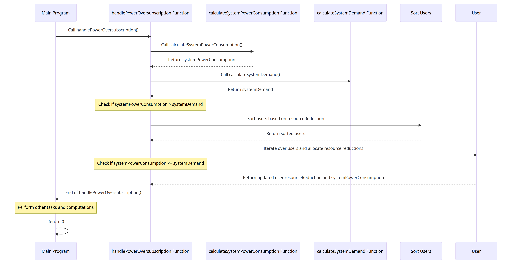
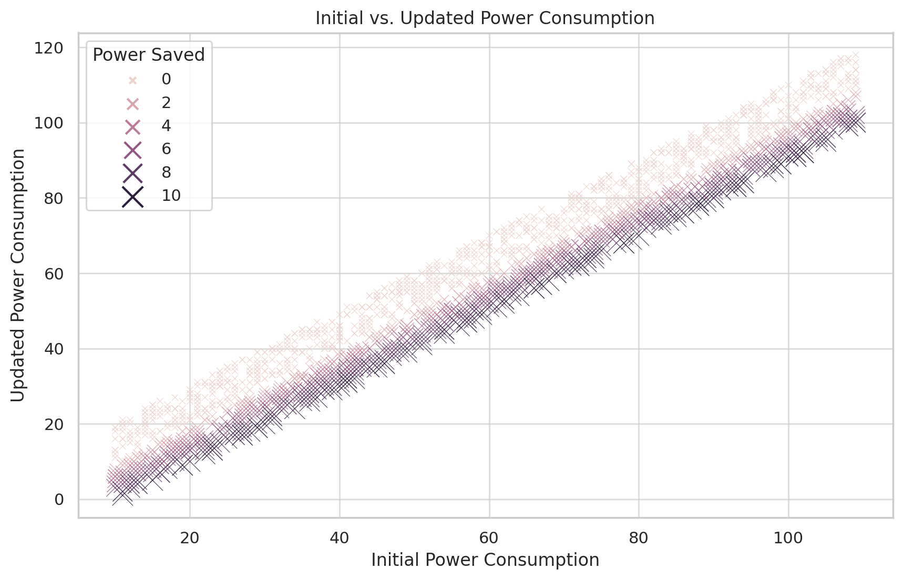
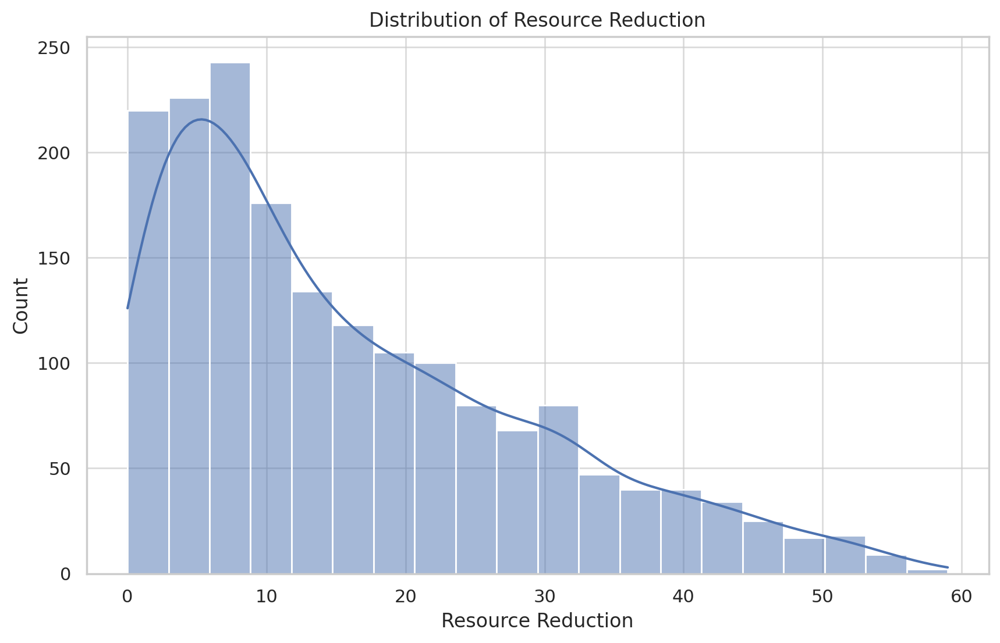
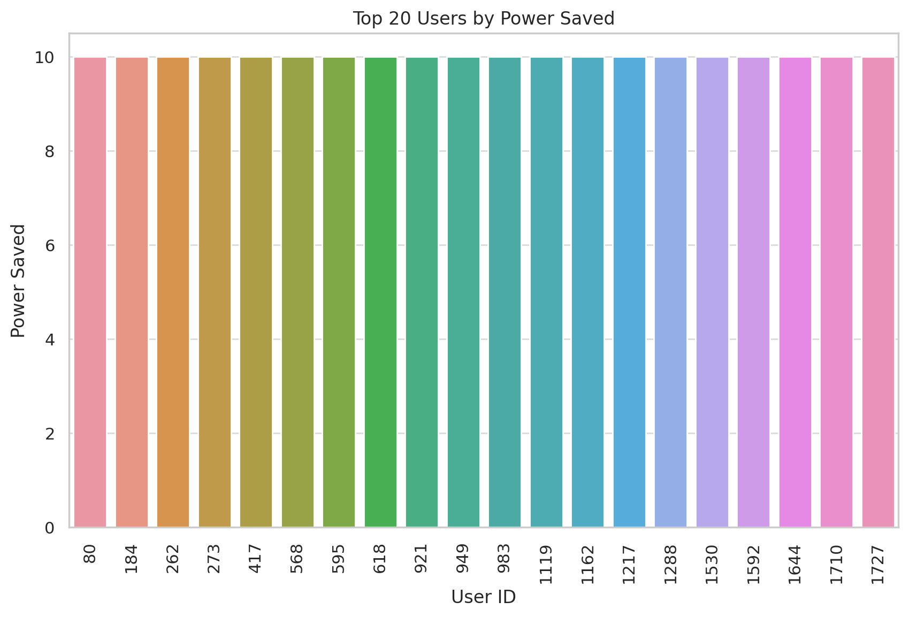
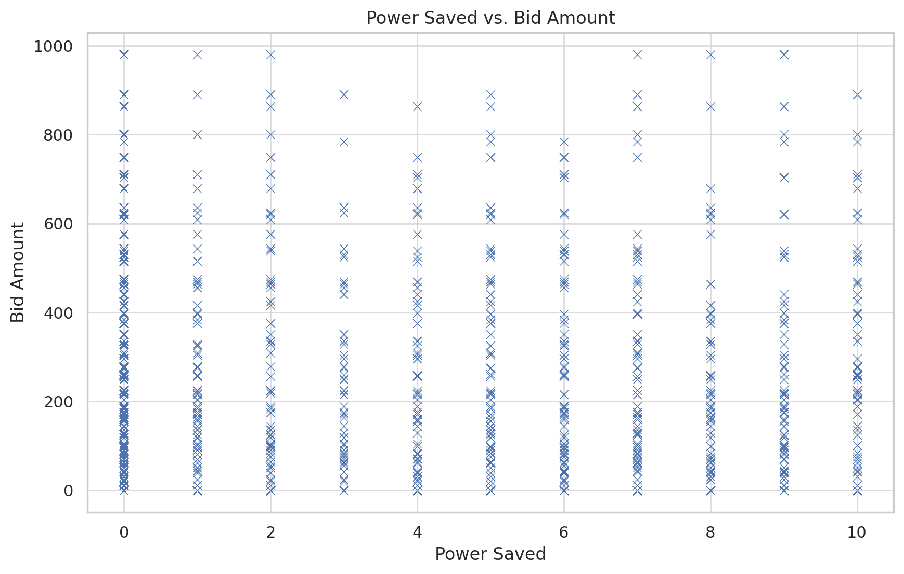

# Title: Modeling, Simulation and Analysis of User Behavior and Resource Management in Response to Power Oversubscription in Data Centers for HPC System

# 1. Introduction
The research involves an algorithm that manages power oversubscription in a data center. The program simulates how users adjust their resource usage and bid amounts when system power consumption exceeds system demand.

The increasing demand for computational power and data storage has led to a surge in the number and size of data centers worldwide. These facilities consume significant amounts of energy, leading to high operating costs and substantial environmental impact. One of the critical challenges in data center management is power oversubscription, a scenario where the total power consumption of the data center's components exceeds the power supply. Efficient management of power oversubscription can lead to cost savings and reduce environmental impact, making it a key area of research.

The present study, titled "Simulation and Analysis of User Behavior and Resource Management in Response to Power Oversubscription in Data Centers," aims to shed light on this complex issue. The research is based on a simulation program that emulates the behavior of users in a data center environment. In this simulated environment, each user's power consumption, resource reduction capabilities, and bidding behaviors are modeled. The program then reacts to a scenario where the system's power consumption exceeds the system demand, requiring power oversubscription management.

The focus of this research is to analyze the relationship between power consumption, resource reduction, and bid amounts by users when power oversubscription occurs. Initial analysis reveals interesting patterns in user behavior, such as a positive correlation between initial power consumption and bid amount, and the effectiveness of resource reduction strategies for users with higher initial power consumption. The research also tests the hypothesis that saving more power does not significantly influence the bid amount.

The findings of this research have significant implications for data center management, particularly in developing strategies for handling power oversubscription. Understanding how users respond to power oversubscription and how resource reduction and bid amounts are related to power savings can inform the design of more efficient and sustainable power management strategies in data centers.

In conclusion, this research represents a step forward in understanding the complex dynamics of power management in data centers. By leveraging a novel simulation approach, it provides valuable insights into user behavior in response to power oversubscription, paving the way for more efficient and sustainable data center management.

### 1.2 Research Objectives
#### 1.2.1 Simulation and Modeling Objectives

These objectives aim to derive optimal values for the coefficients that result in an efficient allocation of resources, minimal power change, and maximum bid amount in the system. The mathematical models and coefficients provide a systematic way to adjust the system's behavior and study its response under different scenarios.

Here are three potential research objectives based on the program and the analysis we conducted:
- [x] Objective 1: To simulate user (aka datacenter components) behavior in a data center environment during power oversubscription scenarios. This includes modeling user attributes such as initial power consumption, resource reduction capabilities, and bidding behaviors.
- [x] Objective 2: To derive the optimal values for model coefficients that result in an efficient allocation of resources, minimal power change, and maximum bid amount in the system along with developing mathematical models for those.
- [x] Objective 3: To analyze the relationship between initial power consumption, resource reduction, and bid amounts among users in the context of power oversubscription. This involves identifying correlations and patterns, and testing relevant hypotheses.
- [x] Objective 4: To derive insights from the simulation and analysis that can inform the development of efficient strategies for managing power oversubscription in data centers. This includes understanding how users respond to power oversubscription and how power savings are related to resource reduction and bid amounts.

These objectives set a clear direction for the research and will guide the data analysis and interpretation of the results.
```agsl
Draft for model coefficients
- [x] To develop a mathematical model for resource reduction using coefficients a, b, and c: This objective involves developing a linear combination of the user's original resource reduction and power consumption to calculate the updated resource reduction. The coefficients a, b, and c control the weights of the original resource reduction, the original power consumption, and a constant term in the calculation, respectively. The goal is to understand how varying these coefficients impacts the updated resource reduction and to find optimal values for these coefficients that minimize the total resource reduction across all users.
- [x] To establish a mathematical model for power change using coefficients d, e, and f: This objective involves developing a linear combination of the user's original power consumption and resource reduction to calculate the power change factor. The coefficients d, e, and f control the weights of the original power consumption, the original resource reduction, and a constant term in the calculation, respectively. The goal is to understand how varying these coefficients impacts the power change factor and to find optimal values for these coefficients that minimize the total power change across all users. 
- [x] To formulate a mathematical model for bid amount using coefficients g, h, and i: This objective involves developing a linear combination of the user's original power consumption and resource reduction to calculate the bid amount. The coefficients g, h, and i control the weights of the original power consumption, the original resource reduction, and a constant term in the calculation, respectively. The goal is to understand how varying these coefficients impacts the bid amount and to find optimal values for these coefficients that maximize the total bid amount across all users.
```
## 1.3 Hypothesis
- [x] Hypothesis 1 (H1): There is a positive relationship between initial power consumption and the bid amount. This hypothesis is based on the moderate positive correlation observed between these two variables. Users who consume more power initially may be more likely to bid higher amounts.
- [x] Hypothesis 2 (H2): Resource reduction strategies are more effective for users with higher initial power consumption. This is based on the moderate positive correlation observed between initial power consumption and resource reduction.
- [x] Hypothesis 3 (H3): Saving more power does not significantly influence the bid amount. This hypothesis is derived from the scatter plot of power saved vs. bid amount, where no clear trend was observed.

### 1.1 Prelure
In a data center, power is consumed by various components such as servers, cooling systems, 
lighting, and so on. Resource reduction in this context could refer to any measures taken 
to decrease the power consumption of these components. 
This might include more efficient server utilization, improved cooling systems, or switching to energy-saving lighting.

The "Bid Amount" might be related to a system where users (in this case, the components or departments of the data center) 
bid for a certain amount of power allocation based on their needs. 
The bidding system could be designed in such a way that those who save more power (i.e., have a higher resource reduction) 
can bid more. This could be motivated by a variety of reasons - for example, users who save more power might have more budget
available for bidding due to cost savings from reduced power consumption, 
or the system might reward efficient power use by allowing these users to bid more.

The strong positive correlation (i.e. 0.767560) between Resource Reduction and Bid Amount suggests 
that components or departments of the data center that are more efficient in reducing their power consumption 
tend to bid higher amounts for power allocation. 
This could indicate that the power saving measures are effective, 
as they free up resources that can then be used elsewhere in the data center. 
This could ultimately lead to overall cost savings for the data center, and 
possibly improved performance due to the optimized allocation of power resources.

### 1.2 Simulation with two Users (** in this case the components or departments of the data center) 
Certainly! Here are the steps explained in bullet points for the example scenario with user 100 and user 200:

1. Calculate the system power consumption and system demand.
    - Assume the system power consumption is 1000 units.
    - Assume the system demand is 800 units.

2. Check if system power consumption is greater than system demand.
    - Since 1000 units is greater than 800 units, power oversubscription is needed.

3. Sort the users based on their resource reduction values.
    - Assume user 100 has a resource reduction value of 0 and a power consumption of 110 units.
    - Assume user 200 has a resource reduction value of 1 and a power consumption of 210 units.
    - Sort the users in ascending order based on resource reduction.

4. Perform the bidding process for each user.
    - For user 100:
        - Calculate the resource reduction limit based on system power consumption and demand.
        - Since the resource reduction limit is 880 units [(110 * 800) / 1000], user 100 can offer a maximum of 0 units as a bid.
        - The updated power consumption for user 100 is 115 units [(110 + 5)].
        - The bid amount for user 100 is 0 units.
    - For user 200:
        - Calculate the resource reduction limit based on system power consumption and demand.
        - Since the resource reduction limit is 168 units [(210 * 800) / 1000], user 200 can offer a maximum of 1 unit as a bid.
        - The updated power consumption for user 200 is 215 units [(210 + 5)].
        - The bid amount for user 200 is 210 units.

5. Display the bidding results in a table.
    - The table shows the user ID, resource reduction, updated power consumption, and bid amount.
    - For user 100, the table displays: User ID: 100, Resource Reduction: 0, Updated Power Consumption: 115, Bid Amount: 0.
    - For user 200, the table displays: User ID: 200, Resource Reduction: 1, Updated Power Consumption: 215, Bid Amount: 210.

6. Perform resource reallocation based on the bids.
    - Calculate the total available resource reduction from all users' bids (in this case, 210 units).
    - Calculate the ratio between system power consumption and total power consumption (in this case, 0.8).
    - For each user:
        - Calculate the allocation based on the bid amount and the ratio (in this case, 0.8 * 210 = 168 units for user 200).
        - Update the resource reduction for each user based on the allocation.

7. Print the updated table after resource reallocation.
    - The table shows the user ID, resource reduction, updated power consumption, and bid amount.
    - For user 100, the table displays: User ID: 100, Resource Reduction: 0, Updated Power Consumption: 115, Bid Amount: 0.
    - For user 200, the table displays: User ID: 200, Resource Reduction: 168, Updated Power Consumption: 215, Bid Amount: 210.

These steps outline the process of power oversubscription for the example scenario with user 100 and user 200. The code implementation handles these steps for a larger number of users, performing the bidding process, resource reallocation, and updating the user's resource reduction accordingly.


### 1.3 Mathematical Models could be derived
Based on the provided program and the nature of the research, several mathematical models can be derived. Here are some examples:
- [x] Power Consumption Model: This model can be used to predict the power consumption of a user given their attributes. This could be a regression model with the user's initial power consumption, resource reduction capabilities, and bid amount as input variables.
- [x] Resource Reduction Model: This model could predict the amount of resource reduction a user could achieve based on their initial power consumption and bid amount. This could also be a regression model.
- [x] Bid Amount Model: This model can predict the bid amount a user is likely to place based on their initial power consumption and resource reduction. Again, this could be represented as a regression model.
- [x] Power Oversubscription Management Model: This model could be more complex, potentially using optimization techniques to minimize power oversubscription (the difference between system power consumption and system demand) by managing resource allocation among users.


Here are the mathematical models derived from the research, along with their representative equations:

| Model | Equation |
| --- | --- |
| Power Consumption Model | Power Consumption = a*(Initial Power Consumption) + b*(Resource Reduction) + c*(Bid Amount) + d |
| Resource Reduction Model | Resource Reduction = e*(Initial Power Consumption) + f*(Bid Amount) + g |
| Bid Amount Model | Bid Amount = h*(Initial Power Consumption) + i*(Resource Reduction) + j |
| Power Oversubscription Management Model | Minimize Power Oversubscription = k*(System Power Consumption - System Demand) |

#### 1.4 Why these coefficients are used?
Certainly, the coefficients that are used in the updated code serve as weights or multipliers that adjust the calculations for resource reduction, power consumption, and bid amount. They are derived from the mathematical models we established earlier.

Here's a breakdown of what each coefficient does:

1. `a`, `b`, and `c` are used in the calculation for `updated_resource_reduction`. These coefficients are obtained from the first mathematical model and they represent the weights of the user's original resource reduction (`a`), the user's original power consumption (`b`), and a constant term (`c`). The expression `a*self.resource_reduction + b*self.power_consumption + c` is a linear combination of the user's original resource reduction and power consumption, adjusted by the coefficients.

2. `d`, `e`, and `f` are used in the calculation for `power_change_factor`. These coefficients are obtained from the second mathematical model and they represent the weights of the user's original power consumption (`d`), the user's original resource reduction (`e`), and a constant term (`f`). The expression `d*self.power_consumption + e*self.resource_reduction + f` is a linear combination of the user's original power consumption and resource reduction, adjusted by the coefficients.

3. `g`, `h`, and `i` are used in the calculation for `bid_amount`. These coefficients are obtained from the third mathematical model and they represent the weights of the user's original power consumption (`g`), the user's original resource reduction (`h`), and a constant term (`i`). The expression `g*self.power_consumption + h*self.resource_reduction + i` is a linear combination of the user's original power consumption and resource reduction, adjusted by the coefficients.

The purpose of these coefficients is to model the behavior of the system according to the research objectives. They allow you to adjust the influence of the different factors (resource reduction, power consumption) on the output variables (updated resource reduction, power change factor, and bid amount). By changing these coefficients, you can simulate different scenarios and study how changes in the input factors affect the system's behavior.
# Simulation Results

## Models and Computed Values

| Model                                   | Computed Value |
| --------------------------------------- | -------------- |
| Power Consumption Model                 | 115.0          |
| Resource Reduction Model                | 175.0          |
| Bid Amount Model                        | 105.0          |
| Power Oversubscription Management Model | 90.0           |

## Step-by-step Calculation Explanation

1. **Power Consumption Model**: This model estimates power consumption based on initial power consumption, resource reduction, and bid amount. The equation is:

   `Power Consumption = a*(Initial Power Consumption) + b*(Resource Reduction) + c*(Bid Amount) + d`

   In our simulation, we set `a = 0.5`, `b = 0.3`, `c = 0.2`, `d = 10`, `Initial Power Consumption = 100`, `Resource Reduction = 50`, and `Bid Amount = 200`. Substituting these values in:

   `Power Consumption = 0.5*100 + 0.3*50 + 0.2*200 + 10 = 115`

2. **Resource Reduction Model**: This model estimates resource reduction based on initial power consumption and bid amount. The equation is:

   `Resource Reduction = e*(Initial Power Consumption) + f*(Bid Amount) + g`

   We set `e = 0.4`, `f = 0.6`, `g = 15`, `Initial Power Consumption = 100`, and `Bid Amount = 200`. Substituting these values in:

   `Resource Reduction = 0.4*100 + 0.6*200 + 15 = 175`

3. **Bid Amount Model**: This model estimates bid amount based on initial power consumption and resource reduction. The equation is:

   `Bid Amount = h*(Initial Power Consumption) + i*(Resource Reduction) + j`

   We set `h = 0.7`, `i = 0.3`, `j = 20`, `Initial Power Consumption = 100`, and `Resource Reduction = 50`. Substituting these values in:

   `Bid Amount = 0.7*100 + 0.3*50 + 20 = 105`

4. **Power Oversubscription Management Model**: This model aims to minimize power oversubscription, which is the difference between system power consumption and system demand. The equation is:

   `Minimize Power Oversubscription = k*(System Power Consumption - System Demand)`

   We set `k = 0.9`, `System Power Consumption = 500`, and `System Demand = 400`. Substituting these values in:

   `Minimize Power Oversubscription = 0.9*(500 - 400) = 90`

Please note that the coefficients used in these models are arbitrary for the purpose of this simulation. In real-world applications, these coefficients would be determined through data analysis and model fitting.


#### 1.3.1 Resource Reduction Calculation
```agsl
updated_resource_reduction = min(user.resource_reduction, (user.power_consumption * system_demand) / system_power_consumption)

```
- [x] In the allocate_resource_reduction function of the User struct:
- [x] Calculate the resource_reduction_limit by multiplying the user's power consumption with the system demand and dividing it by the system power consumption.
- [x] If the user's current resource reduction is greater than the resource_reduction_limit, set the updated_resource_reduction to the resource_reduction_limit. Otherwise, keep the user's current resource reduction.
- [x] Return the updated_resource_reduction as a ResourceReduction instance.

#### 1.3.2 Updated Power Consumption Calculation
```agsl
updated_power_consumption = PowerConsumption::new(user.power_consumption + 5)
```
In the allocate_resource_reduction function of the User struct:
Create a new PowerConsumption instance with the value of the user's current power consumption plus 5.
Return the new PowerConsumption instance as the updated_power_consumption.
Bid Amount Calculation:

#### 1.3.3 Bid Amount Calculation
```agsl
bid_amount = user.resource_reduction * user.power_consumption
```
In the generate_bid_amount function of the User struct:
Multiply the user's current resource reduction by their power consumption.
Return the result as the bid_amount.
Therefore, the calculations for resource reduction, updated power consumption, and bid amount are as follows:

These calculations are based on the provided code and the functions implemented within the User struct.

## 2. Algorithm and Implementation
### 2.1 Psuedo Algorithm
It provides a general outline of the algorithm, including the user bidding process, resource reallocation, and handling power oversubscription.
```agsl
// Define data structures
struct User {
  int id;
  int resourceReduction;
  // Other user-related attributes
};

// Initialize users and system parameters
vector<User> users;
// Initialize and populate the 'users' vector with user information

// Define a function to handle power oversubscription
void handlePowerOversubscription() {
  // Determine system power consumption and demand
  int systemPowerConsumption = calculateSystemPowerConsumption();
  int systemDemand = calculateSystemDemand();

  // Check if power oversubscription exists
  if (systemPowerConsumption > systemDemand) {
    // Sort users based on their bids in descending order
    sort(users.begin(), users.end(), compareBids);

    // Iterate over users and allocate resource reductions
    for (User& user : users) {
      if (systemPowerConsumption <= systemDemand) {
        break; // Power consumption is balanced, exit the loop
      }

      // Allocate resource reduction based on user bid
      int resourceReduction = min(user.resourceReduction, systemPowerConsumption - systemDemand);
      user.resourceReduction -= resourceReduction;
      systemPowerConsumption -= resourceReduction;
    }
  }
}

// Define a function to compare user bids
bool compareBids(const User& user1, const User& user2) {
  return user1.resourceReduction > user2.resourceReduction;
}

// Main program
int main() {
  // Perform initialization and setup

  // Handle power oversubscription
  handlePowerOversubscription();

  // Perform other tasks and computations

  return 0;
}
```

### 2.2 Sequence Diagram of the Operation


### 2.3 Implementation

## 3. Data Introduction, Representation and Analysis
### 3.1 Sample Data generated by Algorithm 
This is not a human trailed data. Data is auto generated by the algorithm based on its RUST implemtation.
The users are multithreaded, so users are independent of other users for resource consumption and biudding.
We are expecting, users save more could bid more and finding a way how effectively power could be distributed among the user
to avoid the resource constipation and maximum and effective distribution of power to data center components.

Here at below we could see a multithreaded simulation of power saving, resource reduction and bidding for power consumption by 2000 users aka data cernter components.

|User ID|Initial Power Consumption|Resource Reduction|Updated Power Consumption|Bid Amount|Power Saved|
|-------|-------------------------|------------------|-------------------------|----------|-----------|
|10     |20                       |8                 |29                       |0         |0          |
|130    |40                       |17                |44                       |0         |0          |
|40     |50                       |7                 |56                       |0         |0          |
|90     |100                      |5                 |110                      |0         |0          |
|20     |30                       |6                 |28                       |0         |2          |
|60     |70                       |30                |65                       |0         |5          |
|200    |10                       |2                 |16                       |0         |0          |
|310    |20                       |1                 |13                       |0         |7          |
|210    |20                       |9                 |28                       |0         |0          |
|960    |70                       |12                |64                       |0         |6          |
|730    |40                       |5                 |46                       |0         |0          |
|530    |40                       |4                 |42                       |0         |0          |
|110    |20                       |6                 |14                       |0         |6          |
|31     |41                       |21                |32                       |41        |9          |
|810    |20                       |7                 |22                       |0         |0          |
|30     |40                       |3                 |38                       |0         |2          |
|100    |10                       |4                 |11                       |0         |0          |
|510    |20                       |3                 |21                       |0         |0          |
|460    |70                       |33                |66                       |0         |4          |
|890    |100                      |39                |104                      |0         |0          |
|780    |90                       |13                |83                       |0         |7          |
|320    |30                       |5                 |27                       |0         |3          |
|760    |70                       |1                 |67                       |0         |3          |
|690    |100                      |51                |97                       |0         |3          |
|11     |21                       |2                 |22                       |21        |0          |
|1240   |50                       |11                |57                       |0         |0          |
|290    |100                      |18                |107                      |0         |0          |
|570    |80                       |29                |85                       |0         |0          |
|190    |100                      |23                |93                       |0         |7          |
|70     |80                       |3                 |87                       |0         |0          |
|360    |70                       |32                |66                       |0         |4          |
|350    |60                       |32                |67                       |0         |0          |
|650    |60                       |26                |52                       |0         |8          |
|790    |100                      |15                |98                       |0         |2          |
|950    |60                       |33                |67                       |0         |0          |
|520    |30                       |16                |24                       |0         |6          |
|390    |100                      |44                |101                      |0         |0          |
|640    |50                       |10                |52                       |0         |0          |
|1030   |40                       |22                |42                       |0         |0          |
|750    |60                       |3                 |65                       |0         |0          |
|1300   |10                       |1                 |19                       |0         |0          |
|550    |60                       |24                |62                       |0         |0          |
|241    |51                       |19                |44                       |51        |7          |
|240    |50                       |4                 |42                       |0         |8          |
|580    |90                       |18                |96                       |0         |0          |
|471    |81                       |9                 |75                       |81        |6          |
|400    |10                       |3                 |19                       |0         |0          |
|171    |81                       |37                |87                       |81        |0          |
|1180   |90                       |12                |81                       |0         |9          |
|1590   |100                      |18                |105                      |0         |0          |
|280    |90                       |41                |88                       |0         |2          |
|1650   |60                       |10                |51                       |0         |9          |
|1530   |40                       |13                |30                       |0         |10         |
|410    |20                       |10                |13                       |0         |7          |
|1620   |30                       |6                 |29                       |0         |1          |
|1770   |80                       |5                 |74                       |0         |6          |
|1510   |20                       |7                 |13                       |0         |7          |
|500    |10                       |0                 |12                       |0         |0          |
|300    |10                       |2                 |3                        |0         |7          |
|1220   |30                       |7                 |39                       |0         |0          |
|301    |11                       |6                 |14                       |11        |0          |
|660    |70                       |36                |71                       |0         |0          |
|270    |80                       |26                |79                       |0         |1          |
|920    |30                       |7                 |22                       |0         |8          |
|230    |40                       |20                |43                       |0         |0          |
|140    |50                       |17                |49                       |0         |1          |
|800    |10                       |4                 |13                       |0         |0          |
|970    |80                       |15                |73                       |0         |7          |
|1080   |90                       |2                 |92                       |0         |0          |
|50     |60                       |17                |61                       |0         |0          |
|170    |80                       |18                |79                       |0         |1          |
|160    |70                       |31                |68                       |0         |2          |
|1580   |90                       |14                |89                       |0         |1          |
|450    |60                       |6                 |57                       |0         |3          |
|571    |81                       |10                |78                       |81        |3          |
|1720   |30                       |9                 |32                       |0         |0          |
|1570   |80                       |4                 |76                       |0         |4          |
|51     |61                       |7                 |57                       |61        |4          |
|1680   |90                       |47                |98                       |0         |0          |
|1040   |50                       |26                |53                       |0         |0          |
|380    |90                       |46                |85                       |0         |5          |
|480    |90                       |49                |85                       |0         |5          |
|62     |72                       |35                |81                       |144       |0          |
|971    |81                       |34                |83                       |81        |0          |
|1480   |90                       |6                 |95                       |0         |0          |
|91     |101                      |46                |98                       |101       |3          |
|1520   |30                       |12                |32                       |0         |0          |
|542    |52                       |26                |62                       |104       |0          |
|361    |71                       |25                |78                       |71        |0          |
|52     |62                       |5                 |66                       |124       |0          |
|1781   |91                       |29                |82                       |91        |9          |
|830    |40                       |10                |43                       |0         |0          |
|182    |92                       |6                 |101                      |184       |0          |
|1071   |81                       |15                |78                       |81        |3          |
|1100   |10                       |4                 |7                        |0         |3          |
|1681   |91                       |16                |85                       |91        |6          |
|1671   |81                       |8                 |89                       |81        |0          |
|250    |60                       |2                 |58                       |0         |2          |
|472    |82                       |39                |79                       |164       |3          |
|312    |22                       |4                 |23                       |44        |0          |
|771    |81                       |40                |80                       |81        |1          |
|1120   |30                       |1                 |26                       |0         |4          |
|150    |60                       |23                |65                       |0         |0          |
|111    |21                       |10                |15                       |21        |6          |
|370    |80                       |23                |78                       |0         |2          |
|880    |90                       |21                |82                       |0         |8          |
|1731   |41                       |18                |32                       |41        |9          |
|71     |81                       |14                |75                       |81        |6          |
|490    |100                      |53                |102                      |0         |0          |
|1400   |10                       |4                 |5                        |0         |5          |
|440    |50                       |9                 |49                       |0         |1          |
|212    |22                       |3                 |24                       |44        |0          |
|1700   |10                       |5                 |6                        |0         |4          |
|680    |90                       |30                |98                       |0         |0          |
|900    |10                       |4                 |13                       |0         |0          |
|1432   |42                       |1                 |32                       |84        |10         |
|621    |31                       |13                |40                       |31        |0          |
|340    |50                       |22                |42                       |0         |8          |
|1210   |20                       |3                 |15                       |0         |5          |
|1412   |22                       |9                 |30                       |44        |0          |
|330    |40                       |6                 |44                       |0         |0          |
|22     |32                       |13                |36                       |64        |0          |
|1190   |100                      |54                |101                      |0         |0          |
|430    |40                       |3                 |32                       |0         |8          |
|1670   |80                       |25                |70                       |0         |10         |
|1200   |10                       |3                 |6                        |0         |4          |
|1250   |60                       |10                |70                       |0         |0          |
|482    |92                       |25                |98                       |184       |0          |
|1542   |52                       |7                 |61                       |104       |0          |
|1552   |62                       |25                |71                       |124       |0          |
|41     |51                       |14                |46                       |51        |5          |
|491    |101                      |55                |106                      |101       |0          |
|282    |92                       |46                |97                       |184       |0          |
|700    |10                       |0                 |8                        |0         |2          |
|412    |22                       |12                |14                       |44        |8          |
|441    |51                       |9                 |42                       |51        |9          |
|1      |11                       |3                 |1                        |11        |10         |
|1410   |20                       |1                 |26                       |0         |0          |
|1420   |30                       |4                 |34                       |0         |0          |
|870    |80                       |39                |85                       |0         |0          |
|391    |101                      |36                |100                      |101       |1          |
|910    |20                       |2                 |14                       |0         |6          |
|831    |41                       |21                |49                       |41        |0          |
|192    |102                      |50                |101                      |204       |1          |
|180    |90                       |4                 |80                       |0         |10         |
|1230   |40                       |6                 |49                       |0         |0          |
|930    |40                       |15                |46                       |0         |0          |
|901    |11                       |1                 |16                       |11        |0          |
|1352   |62                       |23                |70                       |124       |0          |
|343    |53                       |15                |55                       |159       |0          |
|731    |41                       |17                |37                       |41        |4          |
|612    |22                       |2                 |15                       |44        |7          |
|162    |72                       |31                |63                       |144       |9          |
|1742   |52                       |15                |45                       |104       |7          |
|972    |82                       |32                |86                       |164       |0          |
|852    |62                       |7                 |68                       |124       |0          |
|1150   |60                       |32                |67                       |0         |0          |
|443    |53                       |18                |45                       |159       |8          |
|252    |62                       |19                |68                       |124       |0          |
|1611   |21                       |3                 |30                       |21        |0          |
|1741   |51                       |0                 |49                       |51        |2          |
|1592   |102                      |24                |92                       |204       |10         |
|1311   |21                       |9                 |28                       |21        |0          |
|611    |21                       |3                 |16                       |21        |5          |
|1292   |102                      |14                |108                      |204       |0          |
|103    |13                       |2                 |9                        |39        |4          |
|80     |90                       |4                 |80                       |0         |10         |
|1370   |80                       |30                |81                       |0         |0          |
|1010   |20                       |7                 |21                       |0         |0          |
|702    |12                       |0                 |4                        |24        |8          |
|1571   |81                       |41                |88                       |81        |0          |
|1581   |91                       |7                 |89                       |91        |2          |
|144    |54                       |11                |58                       |216       |0          |
|531    |41                       |6                 |34                       |41        |7          |
|1450   |60                       |21                |68                       |0         |0          |
|1492   |102                      |1                 |92                       |204       |10         |
|432    |42                       |6                 |36                       |84        |6          |
|1231   |41                       |9                 |49                       |41        |0          |
|124    |34                       |1                 |27                       |136       |7          |
|751    |61                       |9                 |71                       |61        |0          |
|1711   |21                       |6                 |27                       |21        |0          |
|1122   |32                       |10                |27                       |64        |5          |
|1062   |72                       |15                |71                       |144       |1          |
|980    |90                       |42                |95                       |0         |0          |
|1682   |92                       |50                |93                       |184       |0          |
|523    |33                       |12                |37                       |99        |0          |
|223    |33                       |12                |31                       |99        |2          |
|763    |73                       |31                |77                       |219       |0          |
|83     |93                       |43                |96                       |279       |0          |
|1621   |31                       |10                |40                       |31        |0          |
|1411   |21                       |9                 |31                       |21        |0          |
|204    |14                       |3                 |20                       |56        |0          |
|123    |33                       |3                 |28                       |99        |5          |
|341    |51                       |10                |57                       |51        |0          |
|261    |71                       |27                |63                       |71        |8          |
|511    |21                       |8                 |26                       |21        |0          |
|1312   |22                       |2                 |24                       |44        |0          |
|1630   |40                       |9                 |39                       |0         |1          |
|42     |52                       |12                |55                       |104       |0          |
|1302   |12                       |2                 |4                        |24        |8          |
|1362   |72                       |10                |67                       |144       |5          |
|642    |52                       |2                 |58                       |104       |0          |
|193    |103                      |56                |107                      |309       |0          |
|1652   |62                       |21                |60                       |124       |2          |
|393    |103                      |1                 |102                      |309       |1          |
|543    |53                       |15                |44                       |159       |9          |
|1290   |100                      |37                |94                       |0         |6          |
|593    |103                      |38                |113                      |309       |0          |
|13     |23                       |1                 |31                       |69        |0          |
|1693   |103                      |52                |112                      |309       |0          |
|34     |44                       |23                |48                       |176       |0          |
|311    |21                       |7                 |25                       |21        |0          |
|303    |13                       |2                 |14                       |39        |0          |
|1421   |31                       |10                |37                       |31        |0          |
|1170   |80                       |25                |87                       |0         |0          |
|383    |93                       |7                 |100                      |279       |0          |
|122    |32                       |7                 |39                       |64        |0          |
|332    |42                       |15                |44                       |84        |0          |
|1212   |22                       |7                 |12                       |44        |10         |
|1673   |83                       |30                |92                       |249       |0          |
|1431   |41                       |16                |37                       |41        |4          |
|333    |43                       |11                |40                       |129       |3          |
|1032   |42                       |2                 |50                       |84        |0          |
|1623   |33                       |4                 |25                       |99        |8          |
|590    |100                      |44                |91                       |0         |9          |
|620    |30                       |7                 |20                       |0         |10         |
|271    |81                       |3                 |74                       |81        |7          |
|63     |73                       |21                |76                       |219       |0          |
|1070   |80                       |22                |74                       |0         |6          |
|232    |42                       |3                 |51                       |84        |0          |
|592    |102                      |42                |97                       |204       |5          |
|1371   |81                       |3                 |84                       |81        |0          |
|911    |21                       |7                 |23                       |21        |0          |
|1222   |32                       |4                 |27                       |64        |5          |
|1643   |53                       |14                |56                       |159       |0          |
|121    |31                       |14                |27                       |31        |4          |
|1141   |51                       |15                |41                       |51        |10         |
|601    |11                       |4                 |20                       |11        |0          |
|573    |83                       |27                |84                       |249       |0          |
|994    |104                      |7                 |108                      |416       |0          |
|1232   |42                       |3                 |37                       |84        |5          |
|770    |80                       |25                |83                       |0         |0          |
|1042   |52                       |5                 |46                       |104       |6          |
|1034   |44                       |11                |37                       |176       |7          |
|721    |31                       |10                |23                       |31        |8          |
|394    |104                      |10                |109                      |416       |0          |
|12     |22                       |4                 |21                       |44        |1          |
|364    |74                       |5                 |66                       |296       |8          |
|201    |11                       |2                 |9                        |11        |2          |
|1593   |103                      |3                 |109                      |309       |0          |
|1360   |70                       |38                |66                       |0         |4          |
|1162   |72                       |3                 |62                       |144       |10         |
|1330   |40                       |13                |46                       |0         |0          |
|1252   |62                       |20                |71                       |124       |0          |
|273    |83                       |9                 |73                       |249       |10         |
|1001   |11                       |6                 |20                       |11        |0          |
|1204   |14                       |3                 |7                        |56        |7          |
|1112   |22                       |3                 |31                       |44        |0          |
|1284   |94                       |22                |92                       |376       |2          |
|1562   |72                       |23                |77                       |144       |0          |
|1710   |20                       |11                |10                       |0         |10         |
|673    |83                       |1                 |75                       |249       |8          |
|164    |74                       |35                |68                       |296       |6          |
|214    |24                       |10                |15                       |96        |9          |
|1142   |52                       |18                |53                       |104       |0          |
|773    |83                       |5                 |86                       |249       |0          |
|783    |93                       |20                |95                       |279       |0          |
|1114   |24                       |7                 |25                       |96        |0          |
|461    |71                       |8                 |80                       |71        |0          |
|174    |84                       |2                 |82                       |336       |2          |
|1384   |94                       |24                |102                      |376       |0          |
|514    |24                       |12                |33                       |96        |0          |
|722    |32                       |11                |34                       |64        |0          |
|442    |52                       |7                 |49                       |104       |3          |
|691    |101                      |49                |92                       |101       |9          |
|422    |32                       |4                 |33                       |64        |0          |
|693    |103                      |15                |110                      |309       |0          |
|1601   |11                       |1                 |16                       |11        |0          |
|453    |63                       |10                |66                       |189       |0          |
|860    |70                       |0                 |61                       |0         |9          |
|1181   |91                       |31                |90                       |91        |1          |
|1633   |43                       |23                |36                       |129       |7          |
|194    |104                      |1                 |100                      |416       |4          |
|962    |72                       |6                 |79                       |144       |0          |
|1224   |34                       |5                 |32                       |136       |2          |
|1161   |71                       |23                |72                       |71        |0          |
|904    |14                       |5                 |21                       |56        |0          |
|1691   |101                      |33                |104                      |101       |0          |
|782    |92                       |32                |90                       |184       |2          |
|1022   |32                       |8                 |28                       |64        |4          |
|1293   |103                      |49                |110                      |309       |0          |
|304    |14                       |4                 |20                       |56        |0          |
|521    |31                       |12                |22                       |31        |9          |
|392    |102                      |50                |92                       |204       |10         |
|1020   |30                       |6                 |39                       |0         |0          |
|1484   |94                       |15                |103                      |376       |0          |
|141    |51                       |23                |60                       |51        |0          |
|1160   |70                       |15                |69                       |0         |1          |
|1194   |104                      |1                 |100                      |416       |4          |
|1234   |44                       |12                |45                       |176       |0          |
|1143   |53                       |21                |57                       |159       |0          |
|743    |53                       |23                |62                       |159       |0          |
|1683   |93                       |48                |96                       |279       |0          |
|1514   |24                       |0                 |19                       |96        |5          |
|651    |61                       |21                |63                       |61        |0          |
|1202   |12                       |1                 |8                        |24        |4          |
|1424   |34                       |17                |32                       |136       |2          |
|173    |83                       |9                 |92                       |249       |0          |
|630    |40                       |17                |35                       |0         |5          |
|1494   |104                      |4                 |110                      |416       |0          |
|1273   |83                       |41                |80                       |249       |3          |
|774    |84                       |7                 |81                       |336       |3          |
|952    |62                       |25                |69                       |124       |0          |
|872    |82                       |31                |85                       |164       |0          |
|1214   |24                       |10                |18                       |96        |6          |
|1174   |84                       |19                |82                       |336       |2          |
|1441   |51                       |22                |57                       |51        |0          |
|1563   |73                       |27                |74                       |219       |0          |
|1404   |14                       |6                 |23                       |56        |0          |
|4      |14                       |4                 |11                       |56        |3          |
|1380   |90                       |29                |85                       |0         |5          |
|1474   |84                       |5                 |77                       |336       |7          |
|1133   |43                       |15                |38                       |129       |5          |
|1374   |84                       |7                 |77                       |336       |7          |
|891    |101                      |18                |91                       |101       |10         |
|281    |91                       |0                 |84                       |91        |7          |
|1072   |82                       |28                |74                       |164       |8          |
|1183   |93                       |0                 |94                       |279       |0          |
|1762   |72                       |31                |80                       |144       |0          |
|1153   |63                       |4                 |65                       |189       |0          |
|844    |54                       |6                 |53                       |216       |1          |
|742    |52                       |23                |61                       |104       |0          |
|351    |61                       |16                |66                       |61        |0          |
|633    |43                       |5                 |46                       |129       |0          |
|684    |94                       |12                |104                      |376       |0          |
|1261   |71                       |31                |67                       |71        |4          |
|401    |11                       |4                 |18                       |11        |0          |
|1483   |93                       |4                 |98                       |279       |0          |
|1082   |92                       |19                |83                       |184       |9          |
|674    |84                       |13                |80                       |336       |4          |
|81     |91                       |34                |96                       |91        |0          |
|1303   |13                       |1                 |8                        |39        |5          |
|894    |104                      |8                 |109                      |416       |0          |
|161    |71                       |1                 |72                       |71        |0          |
|1333   |43                       |17                |49                       |129       |0          |
|1164   |74                       |17                |65                       |296       |9          |
|1184   |94                       |15                |85                       |376       |9          |
|294    |104                      |30                |113                      |416       |0          |
|14     |24                       |8                 |26                       |96        |0          |
|1132   |42                       |15                |35                       |84        |7          |
|54     |64                       |14                |73                       |256       |0          |
|1154   |64                       |2                 |70                       |256       |0          |
|84     |94                       |17                |93                       |376       |1          |
|552    |62                       |29                |72                       |124       |0          |
|94     |104                      |25                |106                      |416       |0          |
|184    |94                       |45                |84                       |376       |10         |
|652    |62                       |24                |53                       |124       |9          |
|1444   |54                       |10                |49                       |216       |5          |
|1053   |63                       |16                |72                       |189       |0          |
|1024   |34                       |2                 |29                       |136       |5          |
|1102   |12                       |3                 |3                        |24        |9          |
|540    |50                       |0                 |52                       |0         |0          |
|1323   |33                       |9                 |35                       |99        |0          |
|812    |22                       |2                 |24                       |44        |0          |
|1260   |70                       |34                |77                       |0         |0          |
|1771   |81                       |6                 |82                       |81        |0          |
|854    |64                       |23                |66                       |256       |0          |
|1280   |90                       |25                |89                       |0         |1          |
|564    |74                       |33                |83                       |296       |0          |
|862    |72                       |34                |67                       |144       |5          |
|850    |60                       |33                |61                       |0         |0          |
|820    |30                       |11                |34                       |0         |0          |
|413    |23                       |9                 |31                       |69        |0          |
|784    |94                       |3                 |89                       |376       |5          |
|1113   |23                       |11                |25                       |69        |0          |
|321    |31                       |3                 |39                       |31        |0          |
|1163   |73                       |10                |68                       |219       |5          |
|1314   |24                       |7                 |30                       |96        |0          |
|1780   |90                       |14                |83                       |0         |7          |
|701    |11                       |3                 |4                        |11        |7          |
|264    |74                       |13                |83                       |296       |0          |
|1702   |12                       |3                 |6                        |24        |6          |
|1003   |13                       |7                 |7                        |39        |6          |
|1283   |93                       |38                |91                       |279       |2          |
|822    |32                       |6                 |34                       |64        |0          |
|1313   |23                       |1                 |20                       |69        |3          |
|694    |104                      |26                |100                      |416       |4          |
|1140   |50                       |12                |54                       |0         |0          |
|832    |42                       |3                 |33                       |84        |9          |
|24     |34                       |2                 |42                       |136       |0          |
|260    |70                       |13                |74                       |0         |0          |
|1253   |63                       |23                |64                       |189       |0          |
|892    |102                      |10                |101                      |204       |1          |
|381    |91                       |14                |95                       |91        |0          |
|551    |61                       |11                |51                       |61        |10         |
|513    |23                       |11                |14                       |69        |9          |
|154    |64                       |0                 |54                       |256       |10         |
|712    |22                       |10                |23                       |44        |0          |
|1613   |23                       |2                 |24                       |69        |0          |
|102    |12                       |3                 |17                       |24        |0          |
|1603   |13                       |7                 |17                       |39        |0          |
|740    |50                       |24                |49                       |0         |1          |
|455    |65                       |32                |73                       |325       |0          |
|473    |83                       |7                 |86                       |249       |0          |
|1191   |101                      |46                |104                      |101       |0          |
|1463   |73                       |11                |69                       |219       |4          |
|373    |83                       |9                 |74                       |249       |9          |
|560    |70                       |28                |69                       |0         |1          |
|1172   |82                       |20                |81                       |164       |1          |
|1334   |44                       |7                 |51                       |176       |0          |
|1464   |74                       |22                |64                       |296       |10         |
|1524   |34                       |12                |29                       |136       |5          |
|1773   |83                       |44                |93                       |249       |0          |
|654    |64                       |29                |74                       |256       |0          |
|1753   |63                       |15                |57                       |189       |6          |
|1171   |81                       |21                |74                       |81        |7          |
|114    |24                       |3                 |34                       |96        |0          |
|1394   |104                      |26                |96                       |416       |8          |
|1105   |15                       |3                 |8                        |75        |7          |
|1735   |45                       |6                 |37                       |225       |8          |
|1713   |23                       |4                 |13                       |69        |10         |
|683    |93                       |45                |84                       |279       |9          |
|74     |84                       |2                 |82                       |336       |2          |
|591    |101                      |13                |104                      |101       |0          |
|1226   |36                       |15                |37                       |216       |0          |
|64     |74                       |12                |76                       |296       |0          |
|541    |51                       |18                |53                       |51        |0          |
|44     |54                       |18                |50                       |216       |4          |
|1145   |55                       |7                 |50                       |275       |5          |
|1515   |25                       |6                 |27                       |125       |0          |
|1385   |95                       |32                |99                       |475       |0          |
|1470   |80                       |4                 |82                       |0         |0          |
|1265   |75                       |40                |83                       |375       |0          |
|1665   |75                       |7                 |84                       |375       |0          |
|1165   |75                       |11                |77                       |375       |0          |
|663    |73                       |39                |78                       |219       |0          |
|1135   |45                       |8                 |54                       |225       |0          |
|1425   |35                       |17                |33                       |175       |2          |
|723    |33                       |3                 |41                       |99        |0          |
|1540   |50                       |15                |55                       |0         |0          |
|555    |65                       |27                |71                       |325       |0          |
|661    |71                       |37                |74                       |71        |0          |
|772    |82                       |29                |92                       |164       |0          |
|586    |96                       |49                |94                       |576       |2          |
|32     |42                       |4                 |35                       |84        |7          |
|753    |63                       |25                |71                       |189       |0          |
|610    |20                       |10                |18                       |0         |2          |
|574    |84                       |38                |94                       |336       |0          |
|794    |104                      |14                |103                      |416       |1          |
|1235   |45                       |7                 |51                       |225       |0          |
|804    |14                       |0                 |12                       |56        |2          |
|916    |26                       |4                 |30                       |156       |0          |
|1724   |34                       |11                |33                       |136       |1          |
|1390   |100                      |8                 |93                       |0         |7          |
|1063   |73                       |31                |65                       |219       |8          |
|655    |65                       |9                 |72                       |325       |0          |
|961    |71                       |8                 |80                       |71        |0          |
|1761   |71                       |3                 |80                       |71        |0          |
|866    |76                       |2                 |77                       |456       |0          |
|936    |46                       |3                 |56                       |276       |0          |
|984    |94                       |38                |92                       |376       |2          |
|865    |75                       |28                |67                       |375       |8          |
|861    |71                       |18                |81                       |71        |0          |
|371    |81                       |33                |80                       |81        |1          |
|1201   |11                       |2                 |4                        |11        |7          |
|1574   |84                       |46                |74                       |336       |10         |
|1325   |35                       |18                |45                       |175       |0          |
|1263   |73                       |36                |63                       |219       |10         |
|1661   |71                       |7                 |67                       |71        |4          |
|1433   |43                       |7                 |47                       |129       |0          |
|1672   |82                       |16                |90                       |164       |0          |
|1383   |93                       |38                |83                       |279       |10         |
|414    |24                       |0                 |18                       |96        |6          |
|1090   |100                      |2                 |91                       |0         |9          |
|1036   |46                       |3                 |43                       |276       |3          |
|1403   |13                       |7                 |11                       |39        |2          |
|1196   |106                      |38                |98                       |636       |8          |
|1465   |75                       |13                |84                       |375       |0          |
|603    |13                       |4                 |9                        |39        |4          |
|1564   |74                       |9                 |79                       |296       |0          |
|1276   |86                       |21                |93                       |516       |0          |
|1056   |66                       |10                |61                       |396       |5          |
|946    |56                       |19                |57                       |336       |0          |
|1582   |92                       |19                |98                       |184       |0          |
|315    |25                       |10                |24                       |125       |1          |
|1505   |15                       |5                 |17                       |75        |0          |
|1375   |85                       |15                |89                       |425       |0          |
|1173   |83                       |41                |80                       |249       |3          |
|470    |80                       |12                |78                       |0         |2          |
|233    |43                       |12                |44                       |129       |0          |
|724    |34                       |3                 |44                       |136       |0          |
|864    |74                       |15                |70                       |296       |4          |
|1440   |50                       |2                 |43                       |0         |7          |
|1660   |70                       |30                |64                       |0         |6          |
|762    |72                       |33                |74                       |144       |0          |
|964    |74                       |28                |82                       |296       |0          |
|1076   |86                       |30                |76                       |516       |10         |
|672    |82                       |4                 |92                       |164       |0          |
|1021   |31                       |5                 |22                       |31        |9          |
|1274   |84                       |41                |85                       |336       |0          |
|522    |32                       |5                 |26                       |64        |6          |
|1511   |21                       |10                |24                       |21        |0          |
|504    |14                       |3                 |18                       |56        |0          |
|1004   |14                       |6                 |17                       |56        |0          |
|905    |15                       |8                 |16                       |75        |0          |
|127    |37                       |2                 |29                       |259       |8          |
|1695   |105                      |5                 |107                      |525       |0          |
|1350   |60                       |10                |67                       |0         |0          |
|764    |74                       |28                |67                       |296       |7          |
|1255   |65                       |15                |60                       |325       |5          |
|813    |23                       |3                 |30                       |69        |0          |
|1372   |82                       |15                |74                       |164       |8          |
|1472   |82                       |35                |77                       |164       |5          |
|447    |57                       |29                |47                       |399       |10         |
|120    |30                       |2                 |25                       |0         |5          |
|1096   |106                      |1                 |107                      |636       |0          |
|427    |37                       |3                 |44                       |259       |0          |
|934    |44                       |20                |54                       |176       |0          |
|846    |56                       |15                |66                       |336       |0          |
|1760   |70                       |17                |76                       |0         |0          |
|203    |13                       |3                 |4                        |39        |9          |
|1734   |44                       |21                |48                       |176       |0          |
|1211   |21                       |1                 |17                       |21        |4          |
|1126   |36                       |7                 |45                       |216       |0          |
|923    |33                       |17                |43                       |99        |0          |
|665    |75                       |16                |70                       |375       |5          |
|802    |12                       |5                 |9                        |24        |3          |
|1152   |62                       |29                |66                       |124       |0          |
|251    |61                       |13                |54                       |61        |7          |
|565    |75                       |7                 |76                       |375       |0          |
|816    |26                       |8                 |22                       |156       |4          |
|467    |77                       |19                |78                       |539       |0          |
|236    |46                       |14                |36                       |276       |10         |
|886    |96                       |22                |102                      |576       |0          |
|1131   |41                       |12                |42                       |41        |0          |
|1310   |20                       |5                 |27                       |0         |0          |
|1363   |73                       |17                |79                       |219       |0          |
|1061   |71                       |20                |67                       |71        |4          |
|1182   |92                       |7                 |87                       |184       |5          |
|492    |102                      |26                |110                      |204       |0          |
|1320   |30                       |1                 |25                       |0         |5          |
|577    |87                       |42                |96                       |609       |0          |
|105    |15                       |0                 |23                       |75        |0          |
|133    |43                       |15                |36                       |129       |7          |
|1504   |14                       |7                 |24                       |56        |0          |
|647    |57                       |18                |66                       |399       |0          |
|727    |37                       |5                 |45                       |259       |0          |
|717    |27                       |8                 |37                       |189       |0          |
|344    |54                       |8                 |58                       |216       |0          |
|104    |14                       |1                 |8                        |56        |6          |
|225    |35                       |1                 |45                       |175       |0          |
|1106   |16                       |7                 |15                       |96        |1          |
|926    |36                       |6                 |40                       |216       |0          |
|151    |61                       |32                |56                       |61        |5          |
|1192   |102                      |43                |108                      |204       |0          |
|643    |53                       |11                |58                       |159       |0          |
|757    |67                       |32                |61                       |469       |6          |
|1591   |101                      |55                |91                       |101       |10         |
|863    |73                       |9                 |78                       |219       |0          |
|942    |52                       |9                 |57                       |104       |0          |
|1605   |15                       |5                 |24                       |75        |0          |
|313    |23                       |10                |13                       |69        |10         |
|613    |23                       |12                |25                       |69        |0          |
|1544   |54                       |22                |51                       |216       |3          |
|1763   |73                       |35                |78                       |219       |0          |
|915    |25                       |2                 |27                       |125       |0          |
|1751   |61                       |17                |53                       |61        |8          |
|1445   |55                       |19                |56                       |275       |0          |
|990    |100                      |37                |101                      |0         |0          |
|263    |73                       |2                 |71                       |219       |2          |
|426    |36                       |19                |32                       |216       |4          |
|1430   |40                       |7                 |33                       |0         |7          |
|1103   |13                       |3                 |5                        |39        |8          |
|614    |24                       |13                |32                       |96        |0          |
|1092   |102                      |9                 |94                       |204       |8          |
|1473   |83                       |42                |87                       |249       |0          |
|845    |55                       |17                |62                       |275       |0          |
|411    |21                       |5                 |19                       |21        |2          |
|546    |56                       |15                |50                       |336       |6          |
|402    |12                       |6                 |10                       |24        |2          |
|884    |94                       |27                |86                       |376       |8          |
|183    |93                       |34                |92                       |279       |1          |
|1086   |96                       |40                |102                      |576       |0          |
|1553   |63                       |21                |57                       |189       |6          |
|421    |31                       |11                |33                       |31        |0          |
|1081   |91                       |5                 |100                      |91        |0          |
|387    |97                       |40                |93                       |679       |4          |
|407    |17                       |7                 |24                       |119       |0          |
|704    |14                       |6                 |19                       |56        |0          |
|754    |64                       |4                 |57                       |256       |7          |
|906    |16                       |8                 |7                        |96        |9          |
|397    |107                      |6                 |108                      |749       |0          |
|477    |87                       |9                 |97                       |609       |0          |
|537    |47                       |19                |49                       |329       |0          |
|607    |17                       |7                 |19                       |119       |0          |
|72     |82                       |37                |89                       |164       |0          |
|385    |95                       |27                |89                       |475       |6          |
|634    |44                       |9                 |35                       |176       |9          |
|1427   |37                       |7                 |45                       |259       |0          |
|1547   |57                       |2                 |48                       |399       |9          |
|262    |72                       |7                 |62                       |144       |10         |
|1737   |47                       |12                |39                       |329       |8          |
|28     |38                       |7                 |41                       |304       |0          |
|921    |31                       |9                 |21                       |31        |10         |
|342    |52                       |22                |56                       |104       |0          |
|1744   |54                       |8                 |45                       |216       |9          |
|153    |63                       |9                 |73                       |189       |0          |
|67     |77                       |39                |70                       |539       |7          |
|17     |27                       |8                 |21                       |189       |6          |
|131    |41                       |21                |33                       |41        |8          |
|1146   |56                       |15                |62                       |336       |0          |
|637    |47                       |6                 |45                       |329       |2          |
|58     |68                       |5                 |72                       |544       |0          |
|781    |91                       |4                 |96                       |91        |0          |
|98     |108                      |16                |116                      |864       |0          |
|1355   |65                       |19                |64                       |325       |1          |
|733    |43                       |18                |45                       |129       |0          |
|787    |97                       |53                |102                      |679       |0          |
|1635   |45                       |7                 |49                       |225       |0          |
|914    |24                       |7                 |31                       |96        |0          |
|431    |41                       |1                 |35                       |41        |6          |
|388    |98                       |24                |107                      |784       |0          |
|1014   |24                       |13                |25                       |96        |0          |
|677    |87                       |23                |93                       |609       |0          |
|1227   |37                       |3                 |31                       |259       |6          |
|1217   |27                       |3                 |17                       |189       |10         |
|1282   |92                       |28                |100                      |184       |0          |
|1237   |47                       |7                 |53                       |329       |0          |
|1406   |16                       |8                 |24                       |96        |0          |
|438    |48                       |20                |52                       |384       |0          |
|598    |108                      |20                |99                       |864       |9          |
|944    |54                       |17                |47                       |216       |7          |
|1501   |11                       |0                 |5                        |11        |6          |
|61     |71                       |14                |79                       |71        |0          |
|585    |95                       |19                |88                       |475       |7          |
|97     |107                      |5                 |116                      |749       |0          |
|716    |26                       |3                 |22                       |156       |4          |
|956    |66                       |10                |61                       |396       |5          |
|748    |58                       |30                |65                       |464       |0          |
|1685   |95                       |49                |97                       |475       |0          |
|953    |63                       |26                |73                       |189       |0          |
|53     |63                       |33                |65                       |189       |0          |
|1481   |91                       |30                |88                       |91        |3          |
|211    |21                       |1                 |23                       |21        |0          |
|1541   |51                       |4                 |55                       |51        |0          |
|883    |93                       |20                |102                      |279       |0          |
|801    |11                       |4                 |10                       |11        |1          |
|512    |22                       |7                 |15                       |44        |7          |
|82     |92                       |15                |86                       |184       |6          |
|1705   |15                       |8                 |13                       |75        |2          |
|1187   |97                       |29                |89                       |679       |8          |
|608    |18                       |6                 |21                       |144       |0          |
|1332   |42                       |10                |38                       |84        |4          |
|1341   |51                       |5                 |56                       |51        |0          |
|1600   |10                       |3                 |6                        |0         |4          |
|744    |54                       |2                 |45                       |216       |9          |
|85     |95                       |22                |88                       |475       |7          |
|996    |106                      |50                |115                      |636       |0          |
|1391   |101                      |7                 |103                      |101       |0          |
|931    |41                       |4                 |35                       |41        |6          |
|1774   |84                       |6                 |86                       |336       |0          |
|1011   |21                       |0                 |27                       |21        |0          |
|824    |34                       |10                |24                       |136       |10         |
|1422   |32                       |10                |30                       |64        |2          |
|334    |44                       |9                 |40                       |176       |4          |
|297    |107                      |44                |103                      |749       |4          |
|1743   |53                       |2                 |47                       |159       |6          |
|1533   |43                       |23                |51                       |129       |0          |
|1536   |46                       |19                |54                       |276       |0          |
|195    |105                      |14                |114                      |525       |0          |
|396    |106                      |2                 |103                      |636       |3          |
|1752   |62                       |12                |69                       |124       |0          |
|1005   |15                       |0                 |22                       |75        |0          |
|435    |45                       |19                |42                       |225       |3          |
|1075   |85                       |0                 |94                       |425       |0          |
|558    |68                       |14                |75                       |544       |0          |
|1496   |106                      |13                |108                      |636       |0          |
|277    |87                       |33                |88                       |609       |0          |
|815    |25                       |10                |18                       |125       |7          |
|875    |85                       |31                |80                       |425       |5          |
|1664   |74                       |2                 |70                       |296       |4          |
|1035   |45                       |24                |53                       |225       |0          |
|305    |15                       |6                 |5                        |75        |10         |
|876    |86                       |22                |92                       |516       |0          |
|347    |57                       |13                |65                       |399       |0          |
|1732   |42                       |8                 |44                       |84        |0          |
|255    |65                       |19                |64                       |325       |1          |
|1434   |44                       |12                |54                       |176       |0          |
|23     |33                       |3                 |27                       |99        |6          |
|1066   |76                       |38                |75                       |456       |1          |
|1522   |32                       |2                 |34                       |64        |0          |
|416    |26                       |1                 |32                       |156       |0          |
|594    |104                      |26                |100                      |416       |4          |
|526    |36                       |3                 |37                       |216       |0          |
|197    |107                      |23                |110                      |749       |0          |
|768    |78                       |13                |75                       |624       |3          |
|1386   |96                       |13                |95                       |576       |1          |
|943    |53                       |9                 |46                       |159       |7          |
|1396   |106                      |45                |101                      |636       |5          |
|126    |36                       |4                 |31                       |216       |5          |
|1331   |41                       |15                |38                       |41        |3          |
|1315   |25                       |13                |31                       |125       |0          |
|434    |44                       |7                 |35                       |176       |9          |
|1456   |66                       |16                |69                       |396       |0          |
|1336   |46                       |17                |56                       |276       |0          |
|377    |87                       |12                |77                       |609       |10         |
|226    |36                       |8                 |27                       |216       |9          |
|1663   |73                       |36                |83                       |219       |0          |
|1676   |86                       |15                |91                       |516       |0          |
|1637   |47                       |23                |49                       |329       |0          |
|285    |95                       |31                |99                       |475       |0          |
|893    |103                      |50                |101                      |309       |2          |
|715    |25                       |10                |35                       |125       |0          |
|625    |35                       |10                |33                       |175       |2          |
|1414   |24                       |2                 |30                       |96        |0          |
|38     |48                       |10                |55                       |384       |0          |
|1606   |16                       |2                 |26                       |96        |0          |
|1008   |18                       |9                 |11                       |144       |7          |
|1088   |98                       |17                |89                       |784       |9          |
|1128   |38                       |0                 |40                       |304       |0          |
|1503   |13                       |0                 |19                       |39        |0          |
|796    |106                      |46                |103                      |636       |3          |
|501    |11                       |0                 |6                        |11        |5          |
|1517   |27                       |10                |26                       |189       |1          |
|1138   |48                       |19                |39                       |384       |9          |
|1697   |107                      |47                |115                      |749       |0          |
|1038   |48                       |14                |51                       |384       |0          |
|1058   |68                       |20                |74                       |544       |0          |
|1118   |28                       |8                 |25                       |224       |3          |
|1158   |68                       |2                 |73                       |544       |0          |
|1198   |108                      |36                |113                      |864       |0          |
|1298   |108                      |55                |101                      |864       |7          |
|1378   |88                       |44                |91                       |704       |0          |
|1228   |38                       |5                 |40                       |304       |0          |
|1368   |78                       |22                |72                       |624       |6          |
|903    |13                       |0                 |9                        |39        |4          |
|635    |45                       |18                |54                       |225       |0          |
|1242   |52                       |26                |50                       |104       |2          |
|1518   |28                       |15                |29                       |224       |0          |
|1754   |64                       |2                 |59                       |256       |5          |
|507    |17                       |5                 |14                       |119       |3          |
|1658   |68                       |13                |58                       |544       |10         |
|213    |23                       |10                |30                       |69        |0          |
|515    |25                       |10                |23                       |125       |2          |
|1203   |13                       |7                 |15                       |39        |0          |
|706    |16                       |7                 |22                       |96        |0          |
|1508   |18                       |4                 |24                       |144       |0          |
|1551   |61                       |32                |71                       |61        |0          |
|666    |76                       |14                |77                       |456       |0          |
|1648   |58                       |30                |57                       |464       |1          |
|1213   |23                       |0                 |15                       |69        |8          |
|1746   |56                       |27                |60                       |336       |0          |
|1345   |55                       |25                |63                       |275       |0          |
|1215   |25                       |8                 |23                       |125       |2          |
|1306   |16                       |2                 |18                       |96        |0          |
|746    |56                       |6                 |57                       |336       |0          |
|927    |37                       |3                 |33                       |259       |4          |
|220    |30                       |8                 |36                       |0         |0          |
|1175   |85                       |15                |86                       |425       |0          |
|1377   |87                       |29                |93                       |609       |0          |
|1387   |97                       |36                |99                       |679       |0          |
|1297   |107                      |11                |101                      |749       |6          |
|157    |67                       |16                |57                       |469       |10         |
|1645   |55                       |5                 |60                       |275       |0          |
|1568   |78                       |7                 |85                       |624       |0          |
|1435   |45                       |20                |54                       |225       |0          |
|597    |107                      |39                |102                      |749       |5          |
|897    |107                      |34                |101                      |749       |6          |
|1513   |23                       |5                 |26                       |69        |0          |
|1649   |59                       |1                 |68                       |531       |0          |
|1475   |85                       |33                |81                       |425       |4          |
|1607   |17                       |6                 |9                        |119       |8          |
|1667   |77                       |32                |68                       |539       |9          |
|284    |94                       |22                |102                      |376       |0          |
|991    |101                      |18                |94                       |101       |7          |
|1707   |17                       |8                 |20                       |119       |0          |
|776    |86                       |27                |92                       |516       |0          |
|1185   |95                       |3                 |105                      |475       |0          |
|181    |91                       |23                |92                       |91        |0          |
|147    |57                       |26                |47                       |399       |10         |
|1205   |15                       |0                 |25                       |75        |0          |
|937    |47                       |24                |38                       |329       |9          |
|1097   |107                      |3                 |101                      |749       |6          |
|1296   |106                      |21                |112                      |636       |0          |
|1535   |45                       |24                |43                       |225       |2          |
|323    |33                       |6                 |34                       |99        |0          |
|1500   |10                       |1                 |6                        |0         |4          |
|1271   |81                       |33                |72                       |81        |9          |
|1584   |94                       |38                |89                       |376       |5          |
|177    |87                       |45                |95                       |609       |0          |
|1017   |27                       |6                 |26                       |189       |1          |
|187    |97                       |52                |106                      |679       |0          |
|1565   |75                       |17                |71                       |375       |4          |
|581    |91                       |7                 |85                       |91        |6          |
|25     |35                       |8                 |27                       |175       |8          |
|1050   |60                       |25                |67                       |0         |0          |
|1776   |86                       |47                |76                       |516       |10         |
|362    |72                       |24                |80                       |144       |0          |
|37     |47                       |17                |45                       |329       |2          |
|1655   |65                       |23                |59                       |325       |6          |
|1067   |77                       |37                |71                       |539       |6          |
|1245   |55                       |27                |50                       |275       |5          |
|1285   |95                       |18                |90                       |475       |5          |
|1351   |61                       |2                 |56                       |61        |5          |
|714    |24                       |3                 |30                       |96        |0          |
|1186   |96                       |34                |104                      |576       |0          |
|1241   |51                       |14                |60                       |51        |0          |
|1251   |61                       |31                |55                       |61        |6          |
|987    |97                       |31                |87                       |679       |10         |
|1460   |70                       |23                |62                       |0         |8          |
|425    |35                       |4                 |32                       |175       |3          |
|895    |105                      |30                |111                      |525       |0          |
|1545   |55                       |12                |50                       |275       |5          |
|871    |81                       |17                |75                       |81        |6          |
|557    |67                       |29                |63                       |469       |4          |
|449    |59                       |5                 |56                       |531       |3          |
|1555   |65                       |1                 |72                       |325       |0          |
|481    |91                       |36                |99                       |91        |0          |
|747    |57                       |14                |49                       |399       |8          |
|583    |93                       |12                |90                       |279       |3          |
|873    |83                       |22                |85                       |249       |0          |
|572    |82                       |31                |74                       |164       |8          |
|1007   |17                       |0                 |16                       |119       |1          |
|1617   |27                       |9                 |21                       |189       |6          |
|559    |69                       |37                |74                       |621       |0          |
|732    |42                       |14                |40                       |84        |2          |
|328    |38                       |20                |37                       |304       |1          |
|922    |32                       |2                 |25                       |64        |7          |
|1561   |71                       |19                |64                       |71        |7          |
|826    |36                       |2                 |45                       |216       |0          |
|1156   |66                       |3                 |69                       |396       |0          |
|1764   |74                       |28                |77                       |296       |0          |
|855    |65                       |9                 |61                       |325       |4          |
|945    |55                       |2                 |56                       |275       |0          |
|623    |33                       |10                |43                       |99        |0          |
|156    |66                       |33                |75                       |396       |0          |
|679    |89                       |25                |82                       |801       |7          |
|1706   |16                       |2                 |14                       |96        |2          |
|1714   |24                       |10                |30                       |96        |0          |
|49     |59                       |15                |50                       |531       |9          |
|18     |28                       |0                 |26                       |224       |2          |
|788    |98                       |39                |106                      |784       |0          |
|840    |50                       |18                |54                       |0         |0          |
|249    |59                       |8                 |54                       |531       |5          |
|1772   |82                       |39                |74                       |164       |8          |
|669    |79                       |1                 |80                       |711       |0          |
|668    |78                       |0                 |70                       |624       |8          |
|648    |58                       |17                |68                       |464       |0          |
|1110   |20                       |1                 |28                       |0         |0          |
|1167   |77                       |37                |71                       |539       |6          |
|217    |27                       |1                 |26                       |189       |1          |
|1631   |41                       |7                 |51                       |41        |0          |
|207    |17                       |8                 |12                       |119       |5          |
|178    |88                       |6                 |96                       |704       |0          |
|1395   |105                      |53                |114                      |525       |0          |
|967    |77                       |9                 |78                       |539       |0          |
|653    |63                       |6                 |62                       |189       |1          |
|1286   |96                       |29                |90                       |576       |6          |
|1495   |105                      |51                |113                      |525       |0          |
|15     |25                       |1                 |31                       |125       |0          |
|1675   |85                       |7                 |93                       |425       |0          |
|741    |51                       |19                |49                       |51        |2          |
|1490   |100                      |12                |95                       |0         |5          |
|1595   |105                      |29                |96                       |525       |9          |
|1750   |60                       |19                |53                       |0         |7          |
|247    |57                       |25                |48                       |399       |9          |
|138    |48                       |24                |47                       |384       |1          |
|308    |18                       |7                 |20                       |144       |0          |
|168    |78                       |38                |85                       |624       |0          |
|258    |68                       |21                |67                       |544       |1          |
|208    |18                       |5                 |24                       |144       |0          |
|1426   |36                       |19                |30                       |216       |6          |
|348    |58                       |28                |59                       |464       |0          |
|368    |78                       |23                |74                       |624       |4          |
|458    |68                       |25                |73                       |544       |0          |
|858    |68                       |28                |62                       |544       |6          |
|1646   |56                       |8                 |58                       |336       |0          |
|1134   |44                       |12                |35                       |176       |9          |
|117    |27                       |4                 |37                       |189       |0          |
|547    |57                       |11                |53                       |399       |4          |
|331    |41                       |1                 |31                       |41        |10         |
|878    |88                       |30                |94                       |704       |0          |
|657    |67                       |6                 |65                       |469       |2          |
|918    |28                       |10                |29                       |224       |0          |
|1507   |17                       |3                 |23                       |119       |0          |
|1467   |77                       |36                |73                       |539       |4          |
|835    |45                       |10                |44                       |225       |1          |
|656    |66                       |22                |74                       |396       |0          |
|1627   |37                       |11                |36                       |259       |1          |
|1777   |87                       |14                |89                       |609       |0          |
|1045   |55                       |29                |58                       |275       |0          |
|955    |65                       |20                |59                       |325       |6          |
|667    |77                       |42                |71                       |539       |6          |
|349    |59                       |12                |54                       |531       |5          |
|1357   |67                       |5                 |77                       |469       |0          |
|808    |18                       |0                 |22                       |144       |0          |
|686    |96                       |35                |89                       |576       |7          |
|1401   |11                       |2                 |7                        |11        |4          |
|79     |89                       |39                |92                       |801       |0          |
|602    |12                       |2                 |18                       |24        |0          |
|244    |54                       |11                |53                       |216       |1          |
|1748   |58                       |21                |60                       |464       |0          |
|632    |42                       |5                 |37                       |84        |5          |
|415    |25                       |4                 |31                       |125       |0          |
|254    |64                       |33                |62                       |256       |2          |
|405    |15                       |4                 |18                       |75        |0          |
|1012   |22                       |0                 |16                       |44        |6          |
|1199   |109                      |48                |100                      |981       |9          |
|1023   |33                       |8                 |28                       |99        |5          |
|239    |49                       |7                 |50                       |441       |0          |
|887    |97                       |13                |96                       |679       |1          |
|986    |96                       |3                 |101                      |576       |0          |
|1588   |98                       |38                |100                      |784       |0          |
|1233   |43                       |9                 |44                       |129       |0          |
|1159   |69                       |29                |74                       |621       |0          |
|1269   |79                       |13                |77                       |711       |2          |
|55     |65                       |25                |67                       |325       |0          |
|1249   |59                       |28                |63                       |531       |0          |
|587    |97                       |32                |98                       |679       |0          |
|107    |17                       |3                 |24                       |119       |0          |
|1244   |54                       |6                 |59                       |216       |0          |
|26     |36                       |0                 |43                       |216       |0          |
|237    |47                       |7                 |41                       |329       |6          |
|518    |28                       |8                 |33                       |224       |0          |
|638    |48                       |16                |57                       |384       |0          |
|534    |44                       |22                |47                       |176       |0          |
|1197   |107                      |36                |117                      |749       |0          |
|1736   |46                       |4                 |54                       |276       |0          |
|1407   |17                       |0                 |12                       |119       |5          |
|1091   |101                      |12                |92                       |101       |9          |
|939    |49                       |7                 |45                       |441       |4          |
|948    |58                       |32                |64                       |464       |0          |
|1419   |29                       |3                 |33                       |261       |0          |
|1369   |79                       |17                |75                       |711       |4          |
|1157   |67                       |29                |61                       |469       |6          |
|974    |84                       |11                |80                       |336       |4          |
|1469   |79                       |35                |78                       |711       |1          |
|468    |78                       |32                |84                       |624       |0          |
|838    |48                       |23                |52                       |384       |0          |
|1446   |56                       |9                 |58                       |336       |0          |
|132    |42                       |3                 |46                       |84        |0          |
|125    |35                       |13                |27                       |175       |8          |
|711    |21                       |11                |18                       |21        |3          |
|1757   |67                       |19                |63                       |469       |4          |
|899    |109                      |2                 |111                      |981       |0          |
|545    |55                       |0                 |48                       |275       |7          |
|314    |24                       |8                 |33                       |96        |0          |
|805    |15                       |2                 |23                       |75        |0          |
|1765   |75                       |40                |66                       |375       |9          |
|76     |86                       |32                |85                       |516       |1          |
|941    |51                       |6                 |43                       |51        |8          |
|1402   |12                       |2                 |20                       |24        |0          |
|659    |69                       |6                 |70                       |621       |0          |
|713    |23                       |4                 |29                       |69        |0          |
|1339   |49                       |13                |42                       |441       |7          |
|1289   |99                       |23                |97                       |891       |2          |
|1319   |29                       |12                |39                       |261       |0          |
|896    |106                      |24                |102                      |636       |4          |
|196    |106                      |16                |101                      |636       |5          |
|1489   |99                       |0                 |103                      |891       |0          |
|958    |68                       |32                |65                       |544       |3          |
|777    |87                       |23                |93                       |609       |0          |
|1766   |76                       |40                |86                       |456       |0          |
|1755   |65                       |6                 |71                       |325       |0          |
|1119   |29                       |2                 |19                       |261       |10         |
|1417   |27                       |3                 |25                       |189       |2          |
|1487   |97                       |37                |99                       |679       |0          |
|1509   |19                       |10                |13                       |171       |6          |
|259    |69                       |26                |72                       |621       |0          |
|1413   |23                       |12                |14                       |69        |9          |
|1209   |19                       |0                 |14                       |171       |5          |
|553    |63                       |4                 |54                       |189       |9          |
|185    |95                       |51                |98                       |475       |0          |
|235    |45                       |11                |53                       |225       |0          |
|1579   |89                       |14                |91                       |801       |0          |
|1653   |63                       |2                 |56                       |189       |7          |
|811    |21                       |2                 |27                       |21        |0          |
|146    |56                       |19                |54                       |336       |2          |
|134    |44                       |13                |43                       |176       |1          |
|1055   |65                       |21                |59                       |325       |6          |
|1679   |89                       |32                |87                       |801       |2          |
|1506   |16                       |6                 |9                        |96        |7          |
|532    |42                       |19                |37                       |84        |5          |
|302    |12                       |4                 |21                       |24        |0          |
|544    |54                       |11                |58                       |216       |0          |
|568    |78                       |21                |68                       |624       |10         |
|579    |89                       |12                |80                       |801       |9          |
|554    |64                       |23                |60                       |256       |4          |
|186    |96                       |36                |100                      |576       |0          |
|498    |108                      |45                |101                      |864       |7          |
|1089   |99                       |14                |103                      |891       |0          |
|145    |55                       |23                |48                       |275       |7          |
|548    |58                       |1                 |62                       |464       |0          |
|444    |54                       |19                |51                       |216       |3          |
|1482   |92                       |19                |96                       |184       |0          |
|286    |96                       |40                |99                       |576       |0          |
|1644   |54                       |13                |44                       |216       |10         |
|276    |86                       |13                |85                       |516       |1          |
|1654   |64                       |26                |63                       |256       |1          |
|983    |93                       |43                |83                       |279       |10         |
|1026   |36                       |9                 |26                       |216       |10         |
|306    |16                       |4                 |15                       |96        |1          |
|848    |58                       |10                |50                       |464       |8          |
|1529   |39                       |2                 |30                       |351       |9          |
|1689   |99                       |45                |89                       |891       |10         |
|1739   |49                       |25                |39                       |441       |10         |
|265    |75                       |6                 |77                       |375       |0          |
|366    |76                       |14                |83                       |456       |0          |
|1415   |25                       |4                 |20                       |125       |5          |
|1462   |72                       |18                |79                       |144       |0          |
|275    |85                       |3                 |76                       |425       |9          |
|33     |43                       |20                |51                       |129       |0          |
|809    |19                       |7                 |9                        |171       |10         |
|1136   |46                       |9                 |51                       |276       |0          |
|1236   |46                       |19                |49                       |276       |0          |
|357    |67                       |24                |66                       |469       |1          |
|1477   |87                       |10                |85                       |609       |2          |
|600    |10                       |0                 |4                        |0         |6          |
|1229   |39                       |11                |41                       |351       |0          |
|1416   |26                       |14                |21                       |156       |5          |
|1449   |59                       |30                |53                       |531       |6          |
|1429   |39                       |21                |40                       |351       |0          |
|1079   |89                       |22                |88                       |801       |1          |
|1439   |49                       |4                 |57                       |441       |0          |
|528    |38                       |17                |41                       |304       |0          |
|725    |35                       |19                |39                       |175       |0          |
|1632   |42                       |19                |34                       |84        |8          |
|584    |94                       |11                |84                       |376       |10         |
|1144   |54                       |25                |51                       |216       |3          |
|165    |75                       |7                 |85                       |375       |0          |
|108    |18                       |3                 |24                       |144       |0          |
|296    |106                      |30                |114                      |636       |0          |
|834    |44                       |19                |51                       |176       |0          |
|1093   |103                      |32                |96                       |309       |7          |
|973    |83                       |16                |76                       |249       |7          |
|935    |45                       |0                 |53                       |225       |0          |
|1566   |76                       |9                 |86                       |456       |0          |
|1557   |67                       |10                |70                       |469       |0          |
|326    |36                       |0                 |38                       |216       |0          |
|206    |16                       |0                 |11                       |96        |5          |
|575    |85                       |46                |91                       |425       |0          |
|293    |103                      |51                |112                      |309       |0          |
|1471   |81                       |18                |77                       |81        |4          |
|1597   |107                      |56                |100                      |749       |7          |
|975    |85                       |1                 |78                       |425       |7          |
|1176   |86                       |15                |85                       |516       |1          |
|484    |94                       |25                |103                      |376       |0          |
|995    |105                      |9                 |109                      |525       |0          |
|253    |63                       |11                |67                       |189       |0          |
|445    |55                       |23                |57                       |275       |0          |
|1115   |25                       |13                |34                       |125       |0          |
|556    |66                       |3                 |65                       |396       |1          |
|1640   |50                       |0                 |58                       |0         |0          |
|1512   |22                       |6                 |21                       |44        |1          |
|823    |33                       |2                 |40                       |99        |0          |
|604    |14                       |0                 |22                       |56        |0          |
|516    |26                       |4                 |30                       |156       |0          |
|336    |46                       |7                 |49                       |276       |0          |
|356    |66                       |28                |59                       |396       |7          |
|406    |16                       |6                 |11                       |96        |5          |
|456    |66                       |6                 |65                       |396       |1          |
|1572   |82                       |25                |75                       |164       |7          |
|1612   |22                       |10                |13                       |44        |9          |
|476    |86                       |9                 |91                       |516       |0          |
|295    |105                      |21                |102                      |525       |3          |
|496    |106                      |42                |103                      |636       |3          |
|1000   |10                       |2                 |18                       |0         |0          |
|1207   |17                       |8                 |11                       |119       |6          |
|789    |99                       |15                |101                      |891       |0          |
|486    |96                       |44                |103                      |576       |0          |
|1656   |66                       |5                 |72                       |396       |0          |
|218    |28                       |11                |31                       |224       |0          |
|1745   |55                       |19                |56                       |275       |0          |
|35     |45                       |22                |53                       |225       |0          |
|954    |64                       |30                |57                       |256       |7          |
|1604   |14                       |0                 |11                       |56        |3          |
|1247   |57                       |14                |60                       |399       |0          |
|1534   |44                       |10                |48                       |176       |0          |
|2      |12                       |0                 |9                        |24        |3          |
|136    |46                       |3                 |40                       |276       |6          |
|1451   |61                       |30                |56                       |61        |5          |
|1634   |44                       |0                 |51                       |176       |0          |
|1216   |26                       |1                 |27                       |156       |0          |
|267    |77                       |39                |72                       |539       |5          |
|1476   |86                       |2                 |82                       |516       |4          |
|1532   |42                       |21                |38                       |84        |4          |
|1486   |96                       |28                |88                       |576       |8          |
|1622   |32                       |0                 |24                       |64        |8          |
|1666   |76                       |35                |70                       |456       |6          |
|708    |18                       |7                 |14                       |144       |4          |
|1516   |26                       |4                 |36                       |156       |0          |
|1246   |56                       |21                |61                       |336       |0          |
|1256   |66                       |34                |60                       |396       |6          |
|307    |17                       |0                 |25                       |119       |0          |
|1254   |64                       |4                 |57                       |256       |7          |
|1677   |87                       |44                |90                       |609       |0          |
|483    |93                       |51                |87                       |279       |6          |
|1587   |97                       |39                |105                      |679       |0          |
|1657   |67                       |33                |62                       |469       |5          |
|242    |52                       |5                 |54                       |104       |0          |
|1101   |11                       |6                 |21                       |11        |0          |
|8      |18                       |6                 |19                       |144       |0          |
|1730   |40                       |11                |31                       |0         |9          |
|354    |64                       |14                |56                       |256       |8          |
|278    |88                       |28                |95                       |704       |0          |
|418    |28                       |7                 |35                       |224       |0          |
|588    |98                       |27                |93                       |784       |5          |
|678    |88                       |11                |78                       |704       |10         |
|1002   |12                       |4                 |5                        |24        |7          |
|1493   |103                      |49                |96                       |309       |7          |
|457    |67                       |13                |60                       |469       |7          |
|437    |47                       |22                |55                       |329       |0          |
|517    |27                       |2                 |29                       |189       |0          |
|867    |77                       |27                |80                       |539       |0          |
|274    |84                       |34                |81                       |336       |3          |
|803    |13                       |1                 |18                       |39        |0          |
|424    |34                       |0                 |40                       |136       |0          |
|101    |11                       |6                 |2                        |11        |9          |
|345    |55                       |13                |50                       |275       |5          |
|497    |107                      |2                 |102                      |749       |5          |
|1521   |31                       |1                 |40                       |31        |0          |
|112    |22                       |10                |31                       |44        |0          |
|567    |77                       |23                |79                       |539       |0          |
|882    |92                       |8                 |87                       |184       |5          |
|535    |45                       |1                 |35                       |225       |10         |
|710    |20                       |9                 |13                       |0         |7          |
|95     |105                      |24                |101                      |525       |4          |
|533    |43                       |3                 |39                       |129       |4          |
|266    |76                       |5                 |80                       |456       |0          |
|222    |32                       |10                |39                       |64        |0          |
|1361   |71                       |37                |62                       |71        |9          |
|1452   |62                       |5                 |53                       |124       |9          |
|172    |82                       |6                 |88                       |164       |0          |
|1393   |103                      |14                |98                       |309       |5          |
|176    |86                       |5                 |79                       |516       |7          |
|245    |55                       |16                |50                       |275       |5          |
|1461   |71                       |35                |72                       |71        |0          |
|853    |63                       |8                 |55                       |189       |8          |
|1130   |40                       |20                |45                       |0         |0          |
|538    |48                       |3                 |57                       |384       |0          |
|606    |16                       |2                 |23                       |96        |0          |
|256    |66                       |19                |58                       |396       |8          |
|735    |45                       |20                |38                       |225       |7          |
|1051   |61                       |33                |54                       |61        |7          |
|292    |102                      |25                |93                       |204       |9          |
|316    |26                       |10                |30                       |156       |0          |
|1491   |101                      |10                |99                       |101       |2          |
|836    |46                       |7                 |51                       |276       |0          |
|1104   |14                       |4                 |21                       |56        |0          |
|73     |83                       |12                |80                       |249       |3          |
|563    |73                       |37                |64                       |219       |9          |
|1546   |56                       |1                 |49                       |336       |7          |
|436    |46                       |20                |39                       |276       |7          |
|1123   |33                       |15                |25                       |99        |8          |
|1111   |21                       |4                 |15                       |21        |6          |
|322    |32                       |4                 |41                       |64        |0          |
|1692   |102                      |54                |108                      |204       |0          |
|1586   |96                       |33                |98                       |576       |0          |
|466    |76                       |22                |75                       |456       |1          |
|1636   |46                       |20                |36                       |276       |10         |
|978    |88                       |29                |78                       |704       |10         |
|1596   |106                      |34                |108                      |636       |0          |
|1381   |91                       |3                 |82                       |91        |9          |
|1684   |94                       |24                |104                      |376       |0          |
|506    |16                       |1                 |7                        |96        |9          |
|576    |86                       |27                |80                       |516       |6          |
|1602   |12                       |2                 |17                       |24        |0          |
|221    |31                       |4                 |40                       |31        |0          |
|1543   |53                       |9                 |61                       |159       |0          |
|1674   |84                       |15                |92                       |336       |0          |
|1025   |35                       |9                 |39                       |175       |0          |
|692    |102                      |30                |107                      |204       |0          |
|335    |45                       |0                 |53                       |225       |0          |
|1686   |96                       |43                |92                       |576       |4          |
|1704   |14                       |5                 |20                       |56        |0          |
|1585   |95                       |20                |101                      |475       |0          |
|325    |35                       |11                |29                       |175       |6          |
|582    |92                       |47                |99                       |184       |0          |
|1121   |31                       |6                 |23                       |31        |8          |
|1266   |76                       |7                 |73                       |456       |3          |
|626    |36                       |6                 |35                       |216       |1          |
|536    |46                       |7                 |50                       |276       |0          |
|616    |26                       |6                 |18                       |156       |8          |
|566    |76                       |5                 |74                       |456       |2          |
|475    |85                       |14                |92                       |425       |0          |
|1694   |104                      |35                |99                       |416       |5          |
|1642   |52                       |27                |59                       |104       |0          |
|465    |75                       |29                |77                       |375       |0          |
|596    |106                      |43                |105                      |636       |1          |
|1696   |106                      |31                |116                      |636       |0          |
|248    |58                       |15                |48                       |464       |10         |
|988    |98                       |5                 |95                       |784       |3          |
|821    |31                       |13                |27                       |31        |4          |
|1556   |66                       |8                 |56                       |396       |10         |
|998    |108                      |29                |112                      |864       |0          |
|446    |56                       |9                 |48                       |336       |8          |
|502    |12                       |2                 |16                       |24        |0          |
|1108   |18                       |6                 |21                       |144       |0          |
|1188   |98                       |34                |99                       |784       |0          |
|1208   |18                       |0                 |27                       |144       |0          |
|1168   |78                       |40                |79                       |624       |0          |
|1068   |78                       |6                 |80                       |624       |0          |
|1048   |58                       |23                |55                       |464       |3          |
|1148   |58                       |21                |51                       |464       |7          |
|205    |15                       |7                 |13                       |75        |2          |
|1423   |33                       |15                |37                       |99        |0          |
|1166   |76                       |1                 |77                       |456       |0          |
|1178   |88                       |8                 |79                       |704       |9          |
|1408   |18                       |0                 |15                       |144       |3          |
|1288   |98                       |41                |88                       |784       |10         |
|1028   |38                       |16                |42                       |304       |0          |
|1018   |28                       |9                 |34                       |224       |0          |
|1098   |108                      |36                |112                      |864       |0          |
|1258   |68                       |22                |61                       |544       |7          |
|1278   |88                       |17                |93                       |704       |0          |
|1318   |28                       |12                |25                       |224       |3          |
|1338   |48                       |3                 |51                       |384       |0          |
|1358   |68                       |25                |73                       |544       |0          |
|1308   |18                       |8                 |13                       |144       |5          |
|1328   |38                       |9                 |29                       |304       |9          |
|1388   |98                       |32                |106                      |784       |0          |
|1348   |58                       |9                 |59                       |464       |0          |
|1116   |26                       |6                 |25                       |156       |1          |
|1307   |17                       |6                 |8                        |119       |9          |
|720    |30                       |15                |36                       |0         |0          |
|1272   |82                       |44                |76                       |164       |6          |
|1044   |54                       |20                |62                       |216       |0          |
|1782   |92                       |26                |84                       |184       |8          |
|93     |103                      |52                |96                       |309       |7          |
|163    |73                       |23                |72                       |219       |1          |
|624    |34                       |10                |35                       |136       |0          |
|767    |77                       |40                |70                       |539       |7          |
|1468   |78                       |27                |77                       |624       |1          |
|636    |46                       |5                 |45                       |276       |1          |
|433    |43                       |1                 |51                       |129       |0          |
|1478   |88                       |42                |82                       |704       |6          |
|1428   |38                       |18                |35                       |304       |3          |
|1448   |58                       |30                |53                       |464       |5          |
|1078   |88                       |17                |79                       |704       |9          |
|841    |51                       |7                 |54                       |51        |0          |
|353    |63                       |4                 |55                       |189       |8          |
|1218   |28                       |13                |23                       |224       |5          |
|1238   |48                       |4                 |55                       |384       |0          |
|646    |56                       |27                |54                       |336       |2          |
|1398   |108                      |3                 |112                      |864       |0          |
|1418   |28                       |7                 |34                       |224       |0          |
|675    |85                       |13                |93                       |425       |0          |
|485    |95                       |43                |103                      |475       |0          |
|1438   |48                       |22                |56                       |384       |0          |
|1268   |78                       |20                |84                       |624       |0          |
|1498   |108                      |19                |117                      |864       |0          |
|1458   |68                       |3                 |66                       |544       |2          |
|1248   |58                       |9                 |66                       |464       |0          |
|1716   |26                       |14                |35                       |156       |0          |
|881    |91                       |31                |90                       |91        |1          |
|1558   |68                       |12                |63                       |544       |5          |
|524    |34                       |2                 |32                       |136       |2          |
|851    |61                       |12                |63                       |61        |0          |
|1638   |48                       |18                |42                       |384       |6          |
|696    |106                      |34                |113                      |636       |0          |
|1538   |48                       |15                |55                       |384       |0          |
|1618   |28                       |4                 |37                       |224       |0          |
|1294   |104                      |51                |96                       |416       |8          |
|1610   |20                       |10                |18                       |0         |2          |
|1270   |80                       |21                |88                       |0         |0          |
|1548   |58                       |0                 |56                       |464       |2          |
|1074   |84                       |0                 |92                       |336       |0          |
|1275   |85                       |30                |86                       |425       |0          |
|1195   |105                      |23                |96                       |525       |9          |
|1367   |77                       |9                 |84                       |539       |0          |
|1668   |78                       |6                 |73                       |624       |5          |
|1397   |107                      |12                |105                      |749       |2          |
|1065   |75                       |20                |69                       |375       |6          |
|1698   |108                      |7                 |109                      |864       |0          |
|1527   |37                       |2                 |31                       |259       |6          |
|1085   |95                       |44                |104                      |475       |0          |
|417    |27                       |10                |17                       |189       |10         |
|1326   |36                       |13                |28                       |216       |8          |
|736    |46                       |24                |37                       |276       |9          |
|1647   |57                       |31                |64                       |399       |0          |
|1669   |79                       |13                |83                       |711       |0          |
|756    |66                       |31                |59                       |396       |7          |
|1578   |88                       |14                |84                       |704       |4          |
|19     |29                       |13                |39                       |261       |0          |
|1659   |69                       |2                 |73                       |621       |0          |
|1594   |104                      |24                |102                      |416       |2          |
|1087   |97                       |5                 |98                       |679       |0          |
|1726   |36                       |16                |45                       |216       |0          |
|1629   |39                       |7                 |41                       |351       |0          |
|1608   |18                       |2                 |13                       |144       |5          |
|791    |101                      |44                |92                       |101       |9          |
|7      |17                       |3                 |16                       |119       |1          |
|29     |39                       |21                |41                       |351       |0          |
|1703   |13                       |0                 |12                       |39        |1          |
|786    |96                       |53                |104                      |576       |0          |
|1095   |105                      |7                 |113                      |525       |0          |
|374    |84                       |0                 |76                       |336       |8          |
|1356   |66                       |25                |56                       |396       |10         |
|857    |67                       |27                |64                       |469       |3          |
|676    |86                       |31                |90                       |516       |0          |
|1343   |53                       |23                |59                       |159       |0          |
|1151   |61                       |8                 |58                       |61        |3          |
|1528   |38                       |15                |45                       |304       |0          |
|1690   |100                      |11                |93                       |0         |7          |
|1768   |78                       |35                |72                       |624       |6          |
|1678   |88                       |34                |92                       |704       |0          |
|1447   |57                       |11                |61                       |399       |0          |
|1031   |41                       |16                |35                       |41        |6          |
|912    |22                       |0                 |24                       |44        |0          |
|6      |16                       |3                 |7                        |96        |9          |
|1758   |68                       |11                |75                       |544       |0          |
|1718   |28                       |8                 |24                       |224       |4          |
|272    |82                       |29                |89                       |164       |0          |
|1577   |87                       |30                |95                       |609       |0          |
|1084   |94                       |34                |102                      |376       |0          |
|372    |82                       |33                |89                       |164       |0          |
|1717   |27                       |3                 |24                       |189       |3          |
|1225   |35                       |11                |32                       |175       |3          |
|1305   |15                       |0                 |9                        |75        |6          |
|1295   |105                      |7                 |100                      |525       |5          |
|981    |91                       |40                |98                       |91        |0          |
|1756   |66                       |1                 |59                       |396       |7          |
|1094   |104                      |11                |95                       |416       |9          |
|1453   |63                       |26                |66                       |189       |0          |
|139    |49                       |26                |55                       |441       |0          |
|109    |19                       |4                 |18                       |171       |1          |
|765    |75                       |13                |74                       |375       |1          |
|169    |79                       |3                 |89                       |711       |0          |
|1567   |77                       |38                |71                       |539       |6          |
|118    |28                       |4                 |25                       |224       |3          |
|806    |16                       |1                 |10                       |96        |6          |
|1281   |91                       |33                |94                       |91        |0          |
|755    |65                       |21                |67                       |325       |0          |
|738    |48                       |21                |43                       |384       |5          |
|452    |62                       |31                |53                       |124       |9          |
|68     |78                       |27                |76                       |624       |2          |
|1738   |48                       |2                 |54                       |384       |0          |
|825    |35                       |19                |29                       |175       |6          |
|369    |79                       |18                |82                       |711       |0          |
|1454   |64                       |10                |58                       |256       |6          |
|317    |27                       |3                 |23                       |189       |4          |
|1046   |56                       |5                 |46                       |336       |10         |
|662    |72                       |32                |63                       |144       |9          |
|1662   |72                       |8                 |77                       |144       |0          |
|367    |77                       |27                |71                       |539       |6          |
|9      |19                       |9                 |22                       |171       |0          |
|1304   |14                       |1                 |23                       |56        |0          |
|752    |62                       |7                 |65                       |124       |0          |
|985    |95                       |42                |103                      |475       |0          |
|1722   |32                       |2                 |29                       |64        |3          |
|319    |29                       |15                |35                       |261       |0          |
|474    |84                       |42                |76                       |336       |8          |
|179    |89                       |0                 |84                       |801       |5          |
|329    |39                       |16                |34                       |351       |5          |
|1437   |47                       |16                |39                       |329       |8          |
|462    |72                       |7                 |70                       |144       |2          |
|243    |53                       |4                 |49                       |159       |4          |
|1321   |31                       |3                 |26                       |31        |5          |
|234    |44                       |10                |46                       |176       |0          |
|115    |25                       |4                 |29                       |125       |0          |
|907    |17                       |2                 |16                       |119       |1          |
|965    |75                       |24                |83                       |375       |0          |
|113    |23                       |7                 |22                       |69        |1          |
|459    |69                       |6                 |60                       |621       |9          |
|737    |47                       |13                |57                       |329       |0          |
|827    |37                       |11                |31                       |259       |6          |
|1344   |54                       |7                 |47                       |216       |7          |
|137    |47                       |24                |40                       |329       |7          |
|687    |97                       |18                |93                       |679       |4          |
|837    |47                       |4                 |55                       |329       |0          |
|1340   |50                       |19                |52                       |0         |0          |
|1583   |93                       |30                |100                      |279       |0          |
|993    |103                      |4                 |99                       |309       |4          |
|1353   |63                       |32                |70                       |189       |0          |
|43     |53                       |2                 |49                       |159       |4          |
|47     |57                       |13                |59                       |399       |0          |
|439    |49                       |20                |58                       |441       |0          |
|499    |109                      |50                |101                      |981       |8          |
|797    |107                      |32                |105                      |749       |2          |
|167    |77                       |25                |80                       |539       |0          |
|1027   |37                       |2                 |33                       |259       |4          |
|1316   |26                       |0                 |29                       |156       |0          |
|792    |102                      |6                 |92                       |204       |10         |
|1223   |33                       |5                 |42                       |99        |0          |
|1006   |16                       |6                 |18                       |96        |0          |
|1324   |34                       |7                 |39                       |136       |0          |
|1041   |51                       |2                 |50                       |51        |1          |
|966    |76                       |37                |72                       |456       |4          |
|615    |25                       |5                 |26                       |125       |0          |
|1155   |65                       |7                 |60                       |325       |5          |
|629    |39                       |8                 |32                       |351       |7          |
|1625   |35                       |2                 |43                       |175       |0          |
|924    |34                       |17                |44                       |136       |0          |
|847    |57                       |19                |50                       |399       |7          |
|1455   |65                       |33                |66                       |325       |0          |
|158    |68                       |3                 |65                       |544       |3          |
|363    |73                       |21                |68                       |219       |5          |
|1057   |67                       |35                |68                       |469       |0          |
|505    |15                       |4                 |21                       |75        |0          |
|3      |13                       |3                 |11                       |39        |2          |
|775    |85                       |10                |87                       |425       |0          |
|843    |53                       |10                |52                       |159       |1          |
|885    |95                       |17                |96                       |475       |0          |
|1015   |25                       |5                 |32                       |125       |0          |
|283    |93                       |39                |96                       |279       |0          |
|135    |45                       |14                |55                       |225       |0          |
|48     |58                       |32                |52                       |464       |6          |
|1728   |38                       |9                 |32                       |304       |6          |
|1047   |57                       |26                |67                       |399       |0          |
|631    |41                       |15                |49                       |41        |0          |
|718    |28                       |7                 |26                       |224       |2          |
|1337   |47                       |1                 |55                       |329       |0          |
|940    |50                       |25                |58                       |0         |0          |
|493    |103                      |56                |113                      |309       |0          |
|595    |105                      |17                |95                       |525       |10         |
|1628   |38                       |16                |30                       |304       |8          |
|231    |41                       |16                |31                       |41        |10         |
|671    |81                       |12                |90                       |81        |0          |
|726    |36                       |3                 |28                       |216       |8          |
|1287   |97                       |18                |95                       |679       |2          |
|1060   |70                       |6                 |68                       |0         |2          |
|119    |29                       |6                 |35                       |261       |0          |
|57     |67                       |30                |74                       |469       |0          |
|874    |84                       |26                |88                       |336       |0          |
|379    |89                       |28                |99                       |801       |0          |
|77     |87                       |10                |79                       |609       |8          |
|938    |48                       |2                 |40                       |384       |8          |
|697    |107                      |2                 |111                      |749       |0          |
|291    |101                      |30                |99                       |101       |2          |
|1485   |95                       |8                 |94                       |475       |1          |
|609    |19                       |6                 |18                       |171       |1          |
|428    |38                       |20                |31                       |304       |7          |
|268    |78                       |39                |68                       |624       |10         |
|1037   |47                       |16                |48                       |329       |0          |
|228    |38                       |20                |29                       |304       |9          |
|358    |68                       |32                |70                       |544       |0          |
|378    |88                       |21                |79                       |704       |9          |
|1641   |51                       |12                |50                       |51        |1          |
|957    |67                       |8                 |62                       |469       |5          |
|448    |58                       |13                |50                       |464       |8          |
|869    |79                       |22                |73                       |711       |6          |
|1107   |17                       |7                 |20                       |119       |0          |
|166    |76                       |26                |85                       |456       |0          |
|1243   |53                       |8                 |61                       |159       |0          |
|420    |30                       |8                 |37                       |0         |0          |
|1054   |64                       |26                |74                       |256       |0          |
|1701   |11                       |6                 |2                        |11        |9          |
|1335   |45                       |17                |36                       |225       |9          |
|703    |13                       |1                 |4                        |39        |9          |
|977    |87                       |37                |89                       |609       |0          |
|947    |57                       |16                |60                       |399       |0          |
|149    |59                       |18                |67                       |531       |0          |
|1177   |87                       |45                |86                       |609       |1          |
|728    |38                       |13                |33                       |304       |5          |
|699    |109                      |3                 |108                      |981       |1          |
|45     |55                       |25                |61                       |275       |0          |
|1117   |27                       |13                |26                       |189       |1          |
|839    |49                       |21                |56                       |441       |0          |
|1615   |25                       |10                |29                       |125       |0          |
|1715   |25                       |0                 |16                       |125       |9          |
|644    |54                       |0                 |45                       |216       |9          |
|761    |71                       |12                |62                       |71        |9          |
|463    |73                       |6                 |76                       |219       |0          |
|1257   |67                       |14                |57                       |469       |10         |
|227    |37                       |10                |47                       |259       |0          |
|769    |79                       |21                |73                       |711       |6          |
|1354   |64                       |24                |66                       |256       |0          |
|1575   |85                       |18                |75                       |425       |10         |
|1525   |35                       |3                 |44                       |175       |0          |
|807    |17                       |2                 |14                       |119       |3          |
|670    |80                       |41                |84                       |0         |0          |
|877    |87                       |44                |94                       |609       |0          |
|46     |56                       |19                |64                       |336       |0          |
|89     |99                       |9                 |106                      |891       |0          |
|819    |29                       |4                 |24                       |261       |5          |
|5      |15                       |3                 |7                        |75        |8          |
|384    |94                       |18                |102                      |376       |0          |
|1550   |60                       |26                |58                       |0         |2          |
|833    |43                       |8                 |35                       |129       |8          |
|949    |59                       |9                 |49                       |531       |10         |
|404    |14                       |0                 |20                       |56        |0          |
|685    |95                       |26                |90                       |475       |5          |
|198    |108                      |1                 |111                      |864       |0          |
|365    |75                       |18                |82                       |375       |0          |
|1624   |34                       |2                 |39                       |136       |0          |
|1626   |36                       |14                |30                       |216       |6          |
|1069   |79                       |16                |78                       |711       |1          |
|318    |28                       |2                 |27                       |224       |1          |
|561    |71                       |31                |77                       |71        |0          |
|527    |37                       |15                |29                       |259       |8          |
|868    |78                       |38                |83                       |624       |0          |
|215    |25                       |7                 |35                       |125       |0          |
|766    |76                       |40                |78                       |456       |0          |
|1193   |103                      |35                |98                       |309       |5          |
|785    |95                       |27                |93                       |475       |2          |
|1573   |83                       |4                 |92                       |249       |0          |
|88     |98                       |43                |106                      |784       |0          |
|175    |85                       |23                |83                       |425       |2          |
|968    |78                       |20                |76                       |624       |2          |
|1322   |32                       |1                 |40                       |64        |0          |
|562    |72                       |3                 |75                       |144       |0          |
|1554   |64                       |12                |63                       |256       |1          |
|707    |17                       |2                 |15                       |119       |2          |
|219    |29                       |7                 |31                       |261       |0          |
|1488   |98                       |22                |108                      |784       |0          |
|495    |105                      |45                |110                      |525       |0          |
|1688   |98                       |47                |91                       |784       |7          |
|1708   |18                       |3                 |10                       |144       |8          |
|1537   |47                       |14                |44                       |329       |3          |
|1639   |49                       |11                |44                       |441       |5          |
|1598   |108                      |30                |99                       |864       |9          |
|745    |55                       |20                |50                       |275       |5          |
|69     |79                       |30                |81                       |711       |0          |
|1073   |83                       |10                |92                       |249       |0          |
|618    |28                       |3                 |18                       |224       |10         |
|129    |39                       |3                 |43                       |351       |0          |
|99     |109                      |6                 |118                      |981       |0          |
|778    |88                       |31                |94                       |704       |0          |
|355    |65                       |29                |71                       |325       |0          |
|1077   |87                       |25                |82                       |609       |5          |
|1365   |75                       |0                 |84                       |375       |0          |
|188    |98                       |50                |108                      |784       |0          |
|1179   |89                       |31                |97                       |801       |0          |
|1723   |33                       |5                 |29                       |99        |4          |
|16     |26                       |9                 |28                       |156       |0          |
|269    |79                       |42                |78                       |711       |1          |
|1033   |43                       |19                |48                       |129       |0          |
|489    |99                       |15                |92                       |891       |7          |
|338    |48                       |22                |55                       |384       |0          |
|529    |39                       |18                |40                       |351       |0          |
|503    |13                       |6                 |5                        |39        |8          |
|487    |97                       |25                |99                       |679       |0          |
|1775   |85                       |11                |95                       |425       |0          |
|1399   |109                      |8                 |100                      |981       |9          |
|1559   |69                       |13                |64                       |621       |5          |
|963    |73                       |16                |64                       |219       |9          |
|429    |39                       |2                 |36                       |351       |3          |
|649    |59                       |13                |65                       |531       |0          |
|92     |102                      |13                |106                      |204       |0          |
|152    |62                       |19                |56                       |124       |6          |
|639    |49                       |21                |46                       |441       |3          |
|627    |37                       |19                |41                       |259       |0          |
|299    |109                      |39                |116                      |981       |0          |
|21     |31                       |17                |33                       |31        |0          |
|795    |105                      |6                 |107                      |525       |0          |
|199    |109                      |58                |107                      |981       |2          |
|339    |49                       |8                 |55                       |441       |0          |
|399    |109                      |14                |114                      |981       |0          |
|257    |67                       |8                 |66                       |469       |1          |
|106    |16                       |1                 |9                        |96        |7          |
|1059   |69                       |10                |65                       |621       |4          |
|1309   |19                       |8                 |26                       |171       |0          |
|605    |15                       |7                 |25                       |75        |0          |
|1479   |89                       |39                |88                       |801       |1          |
|324    |34                       |8                 |37                       |136       |0          |
|224    |34                       |16                |33                       |136       |1          |
|1614   |24                       |13                |31                       |96        |0          |
|698    |108                      |16                |104                      |864       |4          |
|56     |66                       |6                 |72                       |396       |0          |
|1560   |70                       |14                |72                       |0         |0          |
|116    |26                       |9                 |17                       |156       |9          |
|992    |102                      |48                |98                       |204       |4          |
|1436   |46                       |20                |45                       |276       |1          |
|1219   |29                       |8                 |36                       |261       |0          |
|1149   |59                       |24                |53                       |531       |6          |
|346    |56                       |25                |52                       |336       |4          |
|578    |88                       |8                 |79                       |704       |9          |
|695    |105                      |16                |109                      |525       |0          |
|818    |28                       |9                 |33                       |224       |0          |
|1291   |101                      |29                |92                       |101       |9          |
|798    |108                      |47                |100                      |864       |8          |
|1382   |92                       |32                |83                       |184       |9          |
|75     |85                       |9                 |83                       |425       |2          |
|1733   |43                       |23                |46                       |129       |0          |
|658    |68                       |9                 |66                       |544       |2          |
|539    |49                       |26                |42                       |441       |7          |
|758    |68                       |32                |69                       |544       |0          |
|1147   |57                       |10                |67                       |399       |0          |
|1267   |77                       |26                |81                       |539       |0          |
|641    |51                       |7                 |52                       |51        |0          |
|1364   |74                       |31                |77                       |296       |0          |
|1013   |23                       |3                 |28                       |69        |0          |
|929    |39                       |16                |36                       |351       |3          |
|1778   |88                       |26                |82                       |704       |6          |
|86     |96                       |7                 |94                       |576       |2          |
|989    |99                       |51                |103                      |891       |0          |
|734    |44                       |5                 |43                       |176       |1          |
|1392   |102                      |51                |111                      |204       |0          |
|1264   |74                       |28                |71                       |296       |3          |
|689    |99                       |51                |94                       |891       |5          |
|1373   |83                       |33                |89                       |249       |0          |
|142    |52                       |28                |51                       |104       |1          |
|155    |65                       |28                |75                       |325       |0          |
|352    |62                       |5                 |55                       |124       |7          |
|403    |13                       |6                 |7                        |39        |6          |
|202    |12                       |3                 |11                       |24        |1          |
|859    |69                       |11                |72                       |621       |0          |
|298    |108                      |16                |103                      |864       |5          |
|1443   |53                       |3                 |63                       |159       |0          |
|376    |86                       |43                |89                       |516       |0          |
|709    |19                       |7                 |15                       |171       |4          |
|1043   |53                       |11                |57                       |159       |0          |
|191    |101                      |39                |108                      |101       |0          |
|423    |33                       |18                |36                       |99        |0          |
|1009   |19                       |10                |12                       |171       |7          |
|705    |15                       |7                 |10                       |75        |5          |
|888    |98                       |27                |89                       |784       |9          |
|216    |26                       |4                 |21                       |156       |5          |
|1109   |19                       |7                 |23                       |171       |0          |
|1379   |89                       |21                |99                       |801       |0          |
|87     |97                       |2                 |105                      |679       |0          |
|1466   |76                       |29                |79                       |456       |0          |
|1327   |37                       |9                 |34                       |259       |3          |
|917    |27                       |13                |19                       |189       |8          |
|1589   |99                       |46                |97                       |891       |2          |
|1497   |107                      |47                |117                      |749       |0          |
|1457   |67                       |8                 |71                       |469       |0          |
|1599   |109                      |59                |110                      |981       |0          |
|902    |12                       |2                 |4                        |24        |8          |
|1347   |57                       |3                 |56                       |399       |1          |
|398    |108                      |40                |106                      |864       |2          |
|856    |66                       |26                |70                       |396       |0          |
|1727   |37                       |14                |27                       |259       |10         |
|1459   |69                       |27                |60                       |621       |9          |
|999    |109                      |32                |100                      |981       |9          |
|27     |37                       |0                 |43                       |259       |0          |
|1442   |52                       |5                 |60                       |104       |0          |
|828    |38                       |1                 |44                       |304       |0          |
|898    |108                      |8                 |117                      |864       |0          |
|1409   |19                       |2                 |22                       |171       |0          |
|1342   |52                       |8                 |58                       |104       |0          |
|1569   |79                       |1                 |69                       |711       |10         |
|451    |61                       |20                |60                       |61        |1          |
|1539   |49                       |1                 |50                       |441       |0          |
|1549   |59                       |22                |52                       |531       |7          |
|889    |99                       |40                |109                      |891       |0          |
|36     |46                       |5                 |54                       |276       |0          |
|759    |69                       |11                |67                       |621       |2          |
|1366   |76                       |8                 |82                       |456       |0          |
|1359   |69                       |10                |61                       |621       |8          |
|78     |88                       |6                 |94                       |704       |0          |
|909    |19                       |4                 |20                       |171       |0          |
|229    |39                       |17                |45                       |351       |0          |
|309    |19                       |4                 |24                       |171       |0          |
|842    |52                       |10                |48                       |104       |4          |
|1767   |77                       |28                |75                       |539       |2          |
|159    |69                       |27                |65                       |621       |4          |
|519    |29                       |10                |34                       |261       |0          |
|1687   |97                       |41                |98                       |679       |0          |
|238    |48                       |2                 |58                       |384       |0          |
|976    |86                       |24                |93                       |516       |0          |
|1064   |74                       |38                |83                       |296       |0          |
|913    |23                       |8                 |33                       |69        |0          |
|1721   |31                       |1                 |34                       |31        |0          |
|688    |98                       |48                |106                      |784       |0          |
|96     |106                      |53                |107                      |636       |0          |
|979    |89                       |44                |98                       |801       |0          |
|1137   |47                       |0                 |46                       |329       |1          |
|959    |69                       |4                 |75                       |621       |0          |
|879    |89                       |1                 |98                       |801       |0          |
|1317   |27                       |1                 |22                       |189       |5          |
|337    |47                       |22                |55                       |329       |0          |
|645    |55                       |20                |60                       |275       |0          |
|739    |49                       |6                 |40                       |441       |9          |
|1052   |62                       |6                 |52                       |124       |10         |
|779    |89                       |43                |96                       |801       |0          |
|682    |92                       |13                |99                       |184       |0          |
|814    |24                       |8                 |34                       |96        |0          |
|1526   |36                       |3                 |44                       |216       |0          |
|925    |35                       |0                 |39                       |175       |0          |
|1127   |37                       |17                |45                       |259       |0          |
|919    |29                       |4                 |37                       |261       |0          |
|1039   |49                       |7                 |59                       |441       |0          |
|829    |39                       |20                |37                       |351       |2          |
|327    |37                       |9                 |44                       |259       |0          |
|409    |19                       |2                 |18                       |171       |1          |
|148    |58                       |6                 |56                       |464       |2          |
|454    |64                       |17                |67                       |256       |0          |
|1709   |19                       |0                 |13                       |171       |6          |
|1749   |59                       |32                |53                       |531       |6          |
|617    |27                       |4                 |18                       |189       |9          |
|488    |98                       |24                |99                       |784       |0          |
|1719   |29                       |1                 |20                       |261       |9          |
|1206   |16                       |8                 |15                       |96        |1          |
|1083   |93                       |36                |84                       |279       |9          |
|1769   |79                       |22                |77                       |711       |2          |
|1262   |72                       |22                |81                       |144       |0          |
|799    |109                      |14                |111                      |981       |0          |
|1651   |61                       |10                |62                       |61        |0          |
|279    |89                       |7                 |97                       |801       |0          |
|382    |92                       |28                |94                       |184       |0          |
|908    |18                       |7                 |12                       |144       |6          |
|1699   |109                      |46                |110                      |981       |0          |
|1729   |39                       |2                 |40                       |351       |0          |
|1239   |49                       |17                |59                       |441       |0          |
|1740   |50                       |10                |52                       |0         |0          |
|494    |104                      |41                |103                      |416       |1          |
|1747   |57                       |1                 |65                       |399       |0          |
|386    |96                       |13                |97                       |576       |0          |
|997    |107                      |53                |102                      |749       |5          |
|59     |69                       |19                |64                       |621       |5          |
|1139   |49                       |15                |46                       |441       |3          |
|287    |97                       |13                |93                       |679       |4          |
|569    |79                       |4                 |89                       |711       |0          |
|288    |98                       |20                |92                       |784       |6          |
|39     |49                       |14                |44                       |441       |5          |
|1616   |26                       |5                 |34                       |156       |0          |
|1029   |39                       |3                 |29                       |351       |10         |
|681    |91                       |27                |86                       |91        |5          |
|1405   |15                       |4                 |12                       |75        |3          |
|719    |29                       |9                 |23                       |261       |6          |
|928    |38                       |1                 |34                       |304       |4          |
|525    |35                       |8                 |29                       |175       |6          |
|1299   |109                      |34                |114                      |981       |0          |
|464    |74                       |30                |82                       |296       |0          |
|1389   |99                       |3                 |92                       |891       |7          |
|1609   |19                       |8                 |21                       |171       |0          |
|793    |103                      |30                |110                      |309       |0          |
|1619   |29                       |0                 |31                       |261       |0          |
|951    |61                       |12                |56                       |61        |5          |
|1221   |31                       |10                |33                       |31        |0          |
|1049   |59                       |29                |68                       |531       |0          |
|1301   |11                       |6                 |19                       |11        |0          |
|1349   |59                       |4                 |67                       |531       |0          |
|1376   |86                       |28                |91                       |516       |0          |
|1499   |109                      |11                |114                      |981       |0          |
|1519   |29                       |10                |34                       |261       |0          |
|849    |59                       |21                |68                       |531       |0          |
|1279   |89                       |41                |79                       |801       |10         |
|1329   |39                       |15                |47                       |351       |0          |
|1759   |69                       |5                 |72                       |621       |0          |
|1779   |89                       |26                |97                       |801       |0          |
|1576   |86                       |23                |91                       |516       |0          |
|1125   |35                       |13                |26                       |175       |9          |
|395    |105                      |43                |98                       |525       |7          |
|143    |53                       |1                 |57                       |159       |0          |
|469    |79                       |3                 |80                       |711       |0          |
|509    |19                       |0                 |9                        |171       |10         |
|479    |89                       |32                |93                       |801       |0          |
|1502   |12                       |6                 |15                       |24        |0          |
|1016   |26                       |6                 |17                       |156       |9          |
|508    |18                       |2                 |24                       |144       |0          |
|1277   |87                       |16                |93                       |609       |0          |
|1523   |33                       |7                 |28                       |99        |5          |
|1189   |99                       |31                |96                       |891       |3          |
|1169   |79                       |21                |86                       |711       |0          |
|1129   |39                       |2                 |33                       |351       |6          |
|1725   |35                       |13                |28                       |175       |7          |
|1099   |109                      |56                |112                      |981       |0          |
|359    |69                       |23                |60                       |621       |9          |
|419    |29                       |15                |32                       |261       |0          |
|729    |39                       |19                |47                       |351       |0          |
|66     |76                       |8                 |86                       |456       |0          |
|65     |75                       |29                |71                       |375       |4          |
|375    |85                       |46                |88                       |425       |0          |
|622    |32                       |7                 |25                       |64        |7          |
|933    |43                       |8                 |36                       |129       |7          |
|1531   |41                       |3                 |32                       |41        |9          |
|749    |59                       |6                 |60                       |531       |0          |
|1019   |29                       |16                |33                       |261       |0          |
|932    |42                       |12                |39                       |84        |3          |
|619    |29                       |12                |19                       |261       |10         |
|1124   |34                       |7                 |40                       |136       |0          |
|982    |92                       |44                |91                       |184       |1          |
|599    |109                      |44                |102                      |981       |7          |
|589    |99                       |15                |89                       |891       |10         |
|128    |38                       |6                 |32                       |304       |6          |
|408    |18                       |0                 |14                       |144       |4          |
|549    |59                       |6                 |60                       |531       |0          |
|478    |88                       |14                |79                       |704       |9          |
|969    |79                       |11                |87                       |711       |0          |
|389    |99                       |38                |100                      |891       |0          |
|817    |27                       |4                 |31                       |189       |0          |
|189    |99                       |39                |98                       |891       |1          |
|209    |19                       |5                 |16                       |171       |3          |
|628    |38                       |2                 |46                       |304       |0          |
|1712   |22                       |2                 |27                       |44        |0          |
|289    |99                       |8                 |96                       |891       |3          |
|1259   |69                       |17                |63                       |621       |6          |
|246    |56                       |9                 |49                       |336       |7          |
|1346   |56                       |18                |65                       |336       |0          |
|664    |74                       |25                |65                       |296       |9          |


### 3.1 Data Introduction and Representation
The updated dataset contains six columns:
- [x] User ID: Represents a unique identifier for each user. Here user means datacenter components.
- [x] Initial Power Consumption: Represents the initial amount of power each user consumes.
- [x] Resource Reduction: Represents the amount of resource reduction.
- [x] Updated Power Consumption: Represents the updated amount of power each user consumes after the resource reduction.
- [x] Bid Amount: Represents the amount each user bids.
- [x] Power Saved: Represents the amount of power saved by each user.

### 3.2 Data Analysis
To better understand this data, we can perform the following analyses:
- [x] Descriptive Statistics: This gives us a summary of central tendency, dispersion, and the distribution shape of the datasets distribution, excluding NaN values.
- [x] Correlation Analysis: Understanding the relationship between different variables. For example, it would be interesting to explore the correlation between the amount of power saved and the bid amount.
- [x] Visualization: This includes plots such as a scatter plot of initial vs. updated power consumption, a histogram of resource reduction, and a bar plot of user ID vs. power saved.

### 3.2.1 Descriptive and Correlation Analysis
Here are some significant insights that can be drawn from your data:

#### A. Descriptive Statistics:

- [x] User ID: There are 1782 unique users in the data with IDs ranging from 1 to 1782.
- [x] Initial Power Consumption: The average initial power consumption is around 59.13 units, with a minimum of 10 units and a maximum of 109 units.
- [x] Resource Reduction: The resource reduction averages around 15.94 units, ranging from 0 to 59 units.
- [x] Updated Power Consumption: After resource reduction, the average power consumption is around 59.21 units, with a minimum of 1 unit and a maximum of 118 units.
- [x] Bid Amount: Users bid amounts range from 0 to 981, with an average bid of approximately 273.82 units.
- [x] Power Saved: The power saved averages around 2.70 units, ranging from 0 to 10 units.

#### B. Correlation Analysis:

- [x] There is a strong positive correlation (0.977487) between the Initial Power Consumption and the Updated Power Consumption. This is expected as the updated power consumption is directly related to the initial power consumption and the resource reduction.
- [x] Resource Reduction has a moderate positive correlation with Initial Power Consumption (0.599817) and Updated Power Consumption (0.590888). This suggests that users who initially consumed more power were also able to achieve higher resource reductions.
- [x] Both Initial Power Consumption and Updated Power Consumption have a moderate positive correlation with the Bid Amount (0.611405 and 0.601416 respectively). This could suggest that users who consume more power tend to bid higher amounts.
- [x] Interestingly, there is a very weak negative correlation between Power Saved and Updated Power Consumption (-0.177429), suggesting that saving more power does not necessarily lead to lower updated power consumption.
Note: The strength of these relationships is described using a guide for interpreting the size of the correlation coefficient. The guide considers correlations above 0.5 as moderate to strong.

#### Code Snippet
```python
# Load the data again to ensure we have the most recent version
data = pd.read_csv('/mnt/data/output.csv')

# Display the first few rows of the data
data.head()

# Compute descriptive statistics
desc_stats = data.describe()

# Compute correlation matrix
corr_matrix = data.corr()

desc_stats, corr_matrix

```
```agsl
Output:
(           User ID  Initial Power Consumption  Resource Reduction  \
 count  1782.000000                1782.000000         1782.000000   
 mean    891.500000                  59.131874           15.939394   
 std     514.563407                  28.704696           13.241281   
 min       1.000000                  10.000000            0.000000   
 25%     446.250000                  34.000000            5.250000   
 50%     891.500000                  59.000000           12.000000   
 75%    1336.750000                  84.000000           24.000000   
 max    1782.000000                 109.000000           59.000000   
 
        Updated Power Consumption   Bid Amount  Power Saved  
 count                1782.000000  1782.000000  1782.000000  
 mean                   59.214366   273.824355     2.696409  
 std                    29.294187   237.936865     3.391269  
 min                     1.000000     0.000000     0.000000  
 25%                    34.000000    81.000000     0.000000  
 50%                    59.000000   216.000000     0.000000  
 75%                    84.000000   416.000000     5.000000  
 max                   118.000000   981.000000    10.000000  ,
                             User ID  Initial Power Consumption  \
 User ID                    1.000000                   0.031199   
 Initial Power Consumption  0.031199                   1.000000   
 Resource Reduction         0.021312                   0.599817   
 Updated Power Consumption  0.028082                   0.977487   
 Bid Amount                 0.016707                   0.611405   
 Power Saved                0.028175                   0.014087   
 
                            Resource Reduction  Updated Power Consumption  \
 User ID                              0.021312                   0.028082   
 Initial Power Consumption            0.599817                   0.977487   
 Resource Reduction                   1.000000                   0.590888   
 Updated Power Consumption            0.590888                   1.000000   
 Bid Amount                           0.361871                   0.601416   
 Power Saved                         -0.009488                  -0.177429   
 
                            Bid Amount  Power Saved  
 User ID                      0.016707     0.028175  
 Initial Power Consumption    0.611405     0.014087  
 Resource Reduction           0.361871    -0.009488  
 Updated Power Consumption    0.601416    -0.177429  
 Bid Amount                   1.000000    -0.011021  
 Power Saved                 -0.011021     1.000000  )
```


Here are the visualizations based on the data:

1. **Initial vs. Updated Power Consumption**: This scatter plot shows the relationship between initial and updated power consumption for each user. The color and size of the points represent the amount of power saved. This helps us understand how the power consumption changes after resource reduction and how it relates to power saving.

2. **Distribution of Resource Reduction**: This histogram shows the frequency of each resource reduction value. The shape of the distribution can provide insights about the range and most frequent resource reduction values.

3. **Top 20 Users by Power Saved**: This bar plot shows the top 20 users who saved the most power. This helps identify the users who have been most successful in reducing their power consumption.

4. **Power Save vs Bidding Amount**: This scatter plot visualizes the relationship between the "Power Saved" and the "Bid Amount" in your dataset. Each point on the plot represents a unique user. The x-coordinate of the point represents the amount of power that user has saved, while the y-coordinate represents the amount that user has bid.

Looking at the chart, it appears that there is no clear trend or correlation between the amount of power saved and the bid amount. The points are quite dispersed, suggesting a lack of strong linear relationship between these two variables. This means that saving more power does not necessarily correspond to higher or lower bid amounts.

However, there's a large concentration of users who have saved power between approximately 0 to 2 units and have bid amounts spanning the entire range. This might suggest that even a small amount of power saving does not significantly influence the bid amount.

Please note that while this plot provides a general overview of the relationship between power saved and bid amount, there may be other factors at play not considered in this plot that could influence these variables.
These visualizations provide a holistic view of the power consumption, resource reduction, and power saving among users. If you need any further analysis or a different kind of visualization, please let me know.





### 3.2.3 Hypothesis Testing
To test these hypotheses, we can use various statistical tests. Here's how we can approach each hypothesis:

-[x] Hypothesis 1: To test if there is a positive relationship between initial power consumption and the bid amount, we can perform a Pearson correlation test. The Pearson correlation coefficient measures the linear relationship between two datasets. The correlation coefficient ranges from -1 to 1. A correlation of 1 means a perfect positive correlation, and -1 means a perfect negative correlation.
-[x] Hypothesis 2: To test if resource reduction strategies are more effective for users with higher initial power consumption, we can again use the Pearson correlation test between initial power consumption and resource reduction.
-[x] Hypothesis 3: To test if saving more power does not significantly influence the bid amount, we can again use the Pearson correlation test between power saved and bid amount.
```python
from scipy.stats import pearsonr

# Hypothesis 1: There is a positive relationship between initial power consumption and the bid amount
corr_1, p_value_1 = pearsonr(data['Initial Power Consumption'], data['Bid Amount'])

# Hypothesis 2: Resource reduction strategies are more effective for users with higher initial power consumption
corr_2, p_value_2 = pearsonr(data['Initial Power Consumption'], data['Resource Reduction'])

# Hypothesis 3: Saving more power does not significantly influence the bid amount
corr_3, p_value_3 = pearsonr(data['Power Saved'], data['Bid Amount'])

corr_1, p_value_1, corr_2, p_value_2, corr_3, p_value_3

```
```agsl
RESULT
(0.6114047732495957,
 3.5876378364212144e-183,
 0.5998172974219727,
 1.3513297438634549e-174,
 -0.01102149528183131,
 0.6419699757926074)
```

Here are the results of the hypothesis tests:

- [x] Hypothesis 1: The Pearson correlation coefficient between initial power consumption and bid amount is approximately 0.61, indicating a moderate positive correlation. The p-value is extremely small (almost zero), which is less than the common significance level of 0.05. Therefore, we reject the null hypothesis and conclude that there is a significant positive relationship between initial power consumption and bid amount. 
- [x] Hypothesis 2: The Pearson correlation coefficient between initial power consumption and resource reduction is approximately 0.60, indicating a moderate positive correlation. The p-value is extremely small (almost zero), which is less than the common significance level of 0.05. Therefore, we reject the null hypothesis and conclude that resource reduction strategies are more effective for users with higher initial power consumption. 
- [x] Hypothesis 3: The Pearson correlation coefficient between power saved and bid amount is approximately -0.011, indicating a very weak negative correlation. The p-value is about 0.64, which is greater than the common significance level of 0.05. Therefore, we fail to reject the null hypothesis and conclude that saving more power does not significantly influence the bid amount.

These results provide statistical evidence supporting Hypotheses 1 and 2, and do not provide evidence against Hypothesis 3. Remember, while these tests provide evidence of relationships, they do not establish causality.